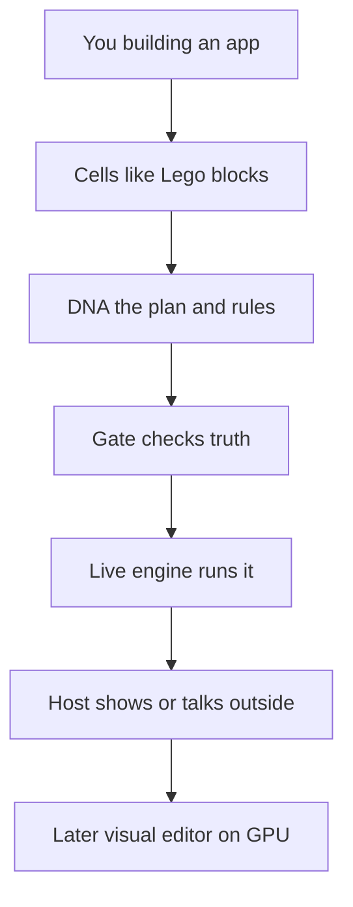
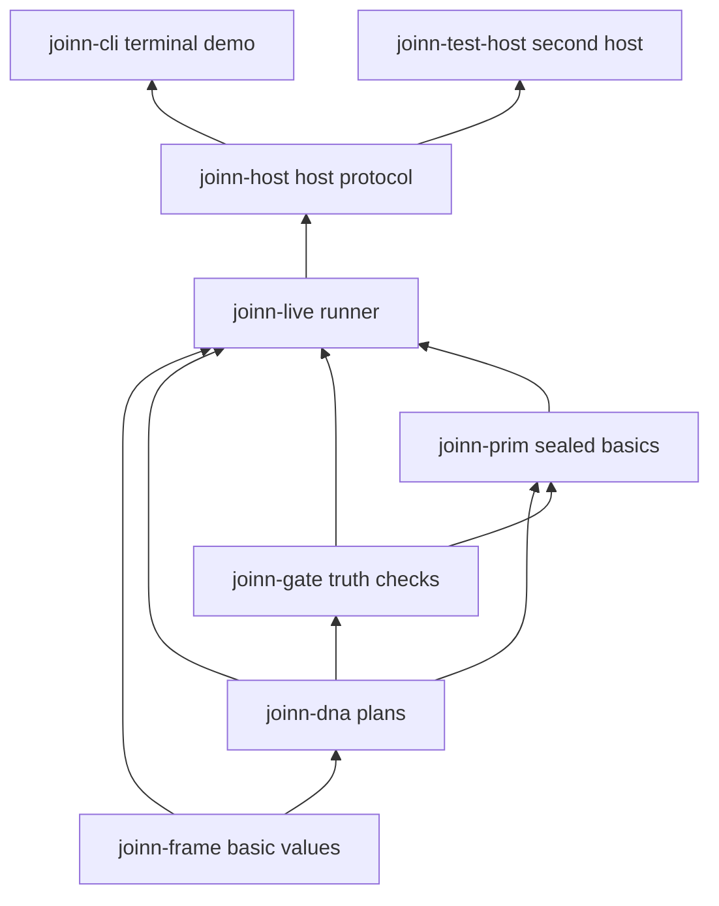
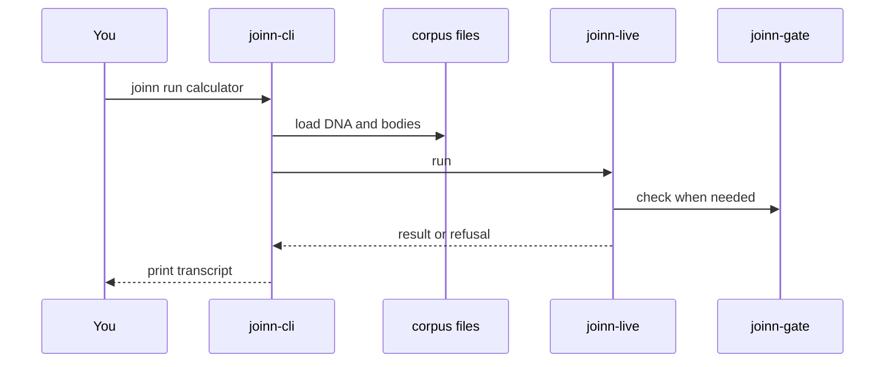
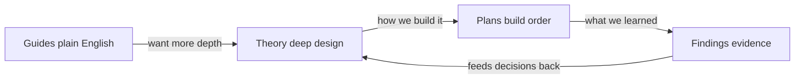

# How the parts connect

This page is the **map**. Each diagram shows how pieces fit. Under the boxes you’ll find **what it is** and **why JoInn needs it**.

If a word is new, peek at the [glossary](05-glossary.md).

---

## 1. Product idea (big picture)



| Piece | What it is | Why it’s necessary |
|-------|------------|--------------------|
| **You** | The creator | JoInn exists so people can build apps |
| **Cells** | Small reusable blocks | Big apps are made of small, understandable parts |
| **DNA** | The plan and the laws for a cell | Without a clear plan, “correct” is only an opinion |
| **Gate** | The checker that admits or refuses growth | So bad or fake growth is refused on purpose, not hoped away |
| **Live engine** | The runner that executes a body step by step | So you get answers now, while the full compiler comes later |
| **Host** | The bridge to the outside (keyboard, screen, tests) | Truth that never meets a person isn’t a product yet |
| **Visual editor (later)** | Draw, pick, and zoom the same universe | The product face — but only after the universe is already true |

---

## 2. Code stack (small picture)

The code is split into **crates** (separate libraries that depend on each other). Think of them as floors of a building: lower floors must exist before the upper ones can stand.

Arrows mean “uses / sits on top of.”



### What each crate does — and why

| Crate | What it does | Why it’s necessary |
|-------|--------------|--------------------|
| **joinn-frame** | Basic values, frames (contexts like “integers”), and verdicts (ok vs refused) | Everything else needs a shared language for “what is a value” and “what is a refusal” |
| **joinn-dna** | Reads, writes, and hashes DNA (plans) | Identity and truth need a precise, checkable written form |
| **joinn-gate** | Runs the law checks and evolution checks; can refuse | Without a gate, “truth first” is a slogan, not a machine |
| **joinn-prim** | The **floor**: sealed basic operations that cells are built from | You need a small, opposed foundation so higher cells aren’t floating on sand |
| **joinn-live** | Runs a body with an explicit step budget (no wild recursion) | Instant feedback; same universe the compiler must later match |
| **joinn-host** | The protocol for hosts: a **description** is a value, not just painted text | So “what was shown” can be compared and proved, not only believed |
| **joinn-cli** | Terminal host: `joinn run calculator` | A real face today, with no GPU required |
| **joinn-test-host** | A second, headless host for tests | **Two hosts prove a host.** Agreement between them catches “it only works on my screen” |

Nearby helpers (not on the stack diagram):

| Piece | What it does | Why it’s necessary |
|-------|--------------|--------------------|
| **corpus/** | Golden example DNA, bodies, transcripts, and deliberate fakes | Testimony and regression: the platform must keep replaying what it claimed was true |
| **xtask** | Build instruments (`vocab`, `floor`, `agree`, `gate`, …) | Machines that print numbers and catch lies; they don’t rewrite the story to look green |

---

## 3. One trip through the calculator

What happens when you run the demo:



In words:

1. You ask the CLI to run the calculator.  
2. The CLI loads the saved plans and bodies from **corpus**.  
3. The **live** engine runs them.  
4. When truth must be judged, the **gate** (and the laws baked into DNA) can **refuse** — for example `"two"` is not an integer.  
5. The CLI prints a transcript for you.

That’s why the expected demo looks like:

```text
a: two
   refused at membrane: "two" is not in ℤ
a: 2
b: 3
2 + 3 = 5
```

The refusal is a **feature**. It shows the system saying “no” instead of crashing or guessing.

Step-by-step to run it yourself: [04-try-the-calculator.md](04-try-the-calculator.md).

---

## 4. How the documentation folders connect



| Folder | Who it’s for | Why it exists |
|--------|--------------|---------------|
| **Guides** | Humans who want clarity first | So the project is understandable without a CS degree |
| **Theory** | Settling the laws and vocabulary | So builders and agents share one precise language |
| **Plans** | Ordered construction | So each step proves one more law by machine, not by hope |
| **Findings** | Dated evidence | So claims leave a paper trail (hashes, reviews, spikes) |

Code entry: [../../joinn/README.md](../../joinn/README.md). Agent rules: [../../joinn/AGENTS.md](../../joinn/AGENTS.md).

---

## Next

- Progress snapshot: [03-where-we-are.md](03-where-we-are.md)  
- Try the demo: [04-try-the-calculator.md](04-try-the-calculator.md)
