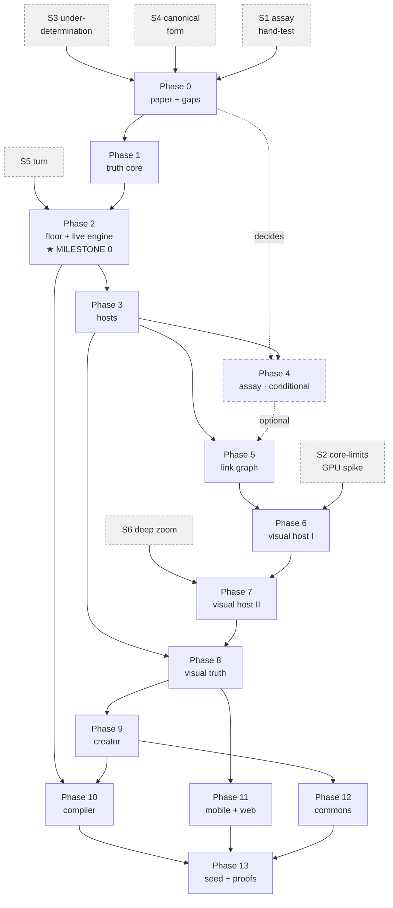

# JoInn Build Roadmap

**Part IV — From theory to a running platform**

*The build plan · what gets made, in what order, and what would prove each step wrong*

Author: AJ · Draft 0.1 · September 17, 2026

> Status tags follow Parts I–III: **DECIDED**, **PROPOSED**, **OPEN**. Roadmap invariants continue Part III's numbering from V27. New research items R19–R25 are tracked in §12 and belong in the backlog.

> **Thesis.** A platform whose central claim is *truth first* cannot be built the way platforms are usually built, which is *demo first*. The order below is derived from the laws rather than from the components: **each phase ends when one more law becomes mechanically enforceable**, and no phase begins before the law it depends on can be checked by a machine. Law 1 is then applied to the plan itself — every phase declares the evidence that would kill it — and the first act of the project is four cheap attempts to kill it.

---

## 0. How to Read This Part

Parts I–III are theory. This part is the opposite compartment: what is actually made, in what order, and how each step is judged. It is a plan for building the platform, not for building an app with it.

| Section | Covers |
|---|---|
| §1 | The three bootstraps — the shape of the whole build |
| §2 | The six laws applied to the plan itself; roadmap invariants V27–V32 |
| §3 | Seven gaps that block Phase 1 and cannot be deferred |
| §4 | Six spikes: buying information before building anything |
| §5 | The phases, each with deliverables, an exit gate, and an adversary |
| §6 | Dependency graph and the critical path |
| §7 | The witness corpus: the platform's own testimony |
| §8 | Crate layout and what is borrowed |
| §9 | Risk register |
| §10 | Cut order, and the minimum true JoInn |
| §11 | What this roadmap refuses to do |
| §12 | New research items, R-item coverage map, decisions |

**Two constraints were set before writing this.** The build is **greenfield** — no crate of yours (`infinite-db`, `biomimicry`, `kip`, `adele-ring`, `roark-beam-formulas`) is assumed, adopted, or depended on; anything of yours that later earns its way in does so through the same gate a stranger's crate would face. And phases are measured by **capability gates, not dates**: a phase ends when its gate passes, and there is no schedule to fall behind.

---

## 1. The Three Bootstraps

JoInn is a system meant to be built out of itself. Every such system has the same problem and the same solution: build it in something else until it can build itself, then throw the ladder away — or, better, keep the ladder and call it the reference implementation.

The whole roadmap is three ladders.

| | Bootstrap | The universe is | Edited in | Ends when |
|---|---|---|---|---|
| **B0** | **True but unseen** | Correct, running, verifiable | A text editor | The calculator transcript prints, refusal and all, with no GPU in the process |
| **B1** | **Seen and touched** | Drawn, picked, zoomed, read aloud | Still a text editor | The same universe renders, picks, and zooms with CPU and GPU agreeing |
| **B2** | **Self-editing** | Built and grown inside itself | JoInn | The creator emits byte-identical canonical DNA, and shows its own parts as cells |

### 1.1 The rule that makes the bootstrap work

> **V27 — Canonical DNA has a textual form a human can read, write, and diff. The visual creator is a view over that form, never its only source.** **DECIDED**

This is the single most important structural decision in the build, and it is the one most likely to be skipped, because the visual creator is the product and a text format feels like a detour. It is not a detour. Four things depend on it:

1. **Content addressing needs a canonical form anyway.** Law 5 is unimplementable without one. Writing it down as text costs nothing extra; it is the canonical form, printed.
2. **You cannot hand-write a witness corpus in a visual editor that does not exist yet.** Phases 1–5 need dozens of hand-written blueprints, including deliberately untrue ones, to test the gate. Those must be typed.
3. **Diffs.** Reviewing what changed between two versions of a blueprint — the entire path of truth — needs a textual diff. A screenshot is not a diff.
4. **Phase 9's exit gate is that the creator and the text form produce the same bytes.** Two editors, one truth: Law 6 applied to authoring. Without a text form there is nothing for the creator to agree with, and no way to detect that the creator has quietly started meaning something different from what it draws.

The cost is one serialization format maintained forever. That is cheap, and it is the same cost every serious system pays.

### 1.2 The discipline this roadmap exists to enforce

The Visual Host is the most exciting part of JoInn and the part most likely to be built first. Part II is finished, vivid, and full of things that would look spectacular within a week. Built first, it would be a renderer with nothing true behind it, and every decision inside it would be made without the constraints that are supposed to produce it — batching from DNA locality, bounded clipping from one-level nesting, unambiguous picking from single ownership. Those are not features to be added; they are consequences of a correct universe. Build the universe first and the renderer falls out. Build the renderer first and the universe has to be bent to fit it.

Pixels come after truth. That sentence is the roadmap.

---

## 2. The Laws, Applied to the Plan

Law 1 says every operation carries its opposition, and lists **adversaries** as one of its forms. A build plan is an operation. Its adversary is the evidence that would prove it wrong.

| Law | Applied to the build | Invariant |
|---|---|---|
| **1 · Opposition** | Every phase names, before it starts, the finding that would kill or reshape it. A phase with no stated adversary is not admitted to the plan. | **V29** |
| **2 · Path of truth** | Every phase is a conservative extension of the last. Every demo that ran at an earlier gate still runs at every later gate. The demo set is the platform's own witness corpus (§7). | **V28** |
| **3 · Semantic zoom** | The plan is readable at three levels: three bootstraps, fourteen phases, and the task lists inside them. Zoomed out, the phases look alike — deliver, gate, adversary. Zoomed in they differ entirely. | — |
| **4 · Consistent containers** | Every phase has the same shape: goal, deliverables, exit gate, adversary, R-items, cost. | — |
| **5 · Identity follows content** | Roadmap-truth is separated from roadmap-decision. Truth: the invariants and exit gates. Decision: crate names, file formats, which platform is first. Decisions are versioned and reversible and do not require a ceremony to change. | **V30** |
| **6 · Two engines, one truth** | Any two things that must agree are cross-checked **from the moment the second one exists**, never later. | **V32** |

### 2.1 Roadmap invariants

| # | Invariant | Source |
|---|---|---|
| **V27** | Canonical DNA has a textual form; the creator is a view over it, never its only source. | §1.1 |
| **V28** | Every demo that passed an earlier phase gate still passes at every later gate, unchanged. | Law 2 |
| **V29** | No phase is entered without a written adversary: the specific observation that would kill or reshape it. | Law 1 |
| **V30** | No phase depends on an unanswered research item. Either a prior phase answers it, or the phase is scoped so the answer cannot change its outcome. | Law 5 |
| **V31** | Nothing the platform *requires* exceeds what the weakest device in the test set can do, and the test set contains a real weak device from the start — not a simulated one. | Part II V11 |
| **V32** | Every pair that must agree — live/compiled, CPU pick/GPU pick, text editor/visual creator, reference allele/sealed allele, embryo/adult renderer — is cross-checked automatically from the moment the second member exists. | Law 6 |

V32 is the one with teeth. The named failure of every system that has tried the reference-plus-fast-path design is that the cross-check is written *after* the fast path is trusted, at which point it finds nothing because nobody runs it. Write the differential harness with the second implementation, in the same commit, or the second implementation is not done.

---

## 3. Seven Gaps That Block Phase 1

These are not research items to be worked on in parallel. They are questions whose answers change the first data structure written, and they must be answered on paper in Phase 0. Recommended answers are given; each is **PROPOSED** and yours to overrule.

### G1 · Are port names inside the coding region?

**Why it blocks.** Identity = frame + contract + laws + witnesses, and a contract is made of ports. If a port's *name* is part of the hash, then renaming `a` to `left` is an evolution event and produces a new cell — which contradicts Part III V24's own example ("rename a port and the answer must not move"). If names are not hashed, then `Sum`'s two in-ports, both `: ℤ`, become indistinguishable, and `turn(c19e, solve for a)` has no way to say which port `a` is.

**Recommended answer.** A port's identity in the coding region is **(direction, frame, declared position)**. The declared position is an ordinal fixed when the port is added and never reused — the same generational-slot idea Part II §7.3 uses on the GPU, applied to contracts. The **display name is regulatory** and may change freely. `turn` refers to positions, not names. Commutativity is then a law stating that positions 0 and 1 are interchangeable, which is exactly what commutativity means and is now checkable rather than assumed. **PROPOSED**

**Consequence.** Adding a port is an evolution event (it changes what is accepted); renaming one is a silent mutation. That is the right split, and it falls straight out of the hash boundary.

### G2 · Recording a witness changes the hash — and therefore the cell

**Why it blocks.** This is a contradiction inside D3, and it is the same failure Part III §2.1 was written to fix, relocated one floor down.

- Identity = frame + contract + laws + **witnesses** (Part III §2.2, §11).
- Part I §12.4: witnesses are "every result the first grader ever confirmed."
- Therefore the first time he computes 7 + 8 and the result is recorded, the witness set changes, the coding region changes, and **the add cell gets a new hash.**

The cell now changes identity every time it is used correctly. "It does not change: he can still add two integers" has become a changelog again, and this time the changelog is written by success rather than by growth.

**Recommended answer.** Split the notion in two.

| | **Founding witnesses** | **Accumulated testimony** |
|---|---|---|
| What | A small, deliberately chosen set that pins the cell's meaning | Everything the cell has ever been observed to do truly |
| Chosen by | The creator, at the moment a coding region is written or extended | The runtime, automatically |
| Hashed | **Yes** — part of identity | **No** |
| Replayed by the gate | Always, all of them | Sampled, budgeted |
| Grows | Only through an evolution event | Freely, forever |
| Analogy | The axioms you would cite to explain what the cell *is* | The regression suite |

Law 5 then reads: **hash only what a change must be judged against.** Founding witnesses are what a future version must honor to be the same cell. Accumulated testimony is evidence, and evidence that a change contradicts is still a refusal — it simply is not identity. Without this split, the gate's replay cost also grows without bound, which is the second reason to make it. **PROPOSED · R19**

### G3 · A frame must supply more than axioms

**Why it blocks.** Phase 1 cannot check a single law without knowing what a frame owes the platform. "Laws hold on sampled inputs" presumes a sampler, and nothing in Parts I–III says where one comes from.

**Recommended answer.** A frame is admitted only if it supplies all of:

| Obligation | Why |
|---|---|
| A value representation | Something has to be stored and hashed |
| Equality | `eq` is the root of Law 1; without it there is no validation at all |
| A canonical form | Witnesses must be comparable across versions and machines |
| Generators | Laws are checked on samples; a frame with no sampler has uncheckable laws |
| A printer and a parser | So testimony is readable and diffable (V27) |
| For an extension: an **embedding and a restriction**, witnessed as inverse on the old frame | This is what makes "conservative extension" mechanical instead of aspirational |

The last row is Law 1 applied to frames, and it is the thing that actually makes the reference example work. ℤ ↪ ℚ is not a fact the gate can assume; it is a pair of maps the frame must hand over, which the gate then checks round-trip on the old frame's witnesses. When AISC 360-16 and 360-22 sit side by side (Part I §9.3), the same obligation is what lets opposition compare them. **PROPOSED · R20**

### G4 · Determinism must be promoted from PROPOSED to DECIDED

**Why it blocks.** Law 6, V32, V13, V22 and the entire differential-testing strategy are meaningless if the same input can legitimately produce two answers. Part I §4.3 has "side effects at the membrane" and "the engine stays pure" as **PROPOSED**.

**Recommended answer.** Promote both to **DECIDED** at Phase 1 and add a third: **message delivery order within a body is a deterministic function of the grant sequence**, not of arrival time. The calculator note already chose ordering by capability rather than by clock; making it a determinism guarantee is free and it is what lets the live engine and the compiler be compared at all. Non-determinism, where it is genuinely needed, enters as an explicit value crossing a membrane — a seed, a clock reading — never as an ambient property of execution. **PROPOSED**

### G5 · Join semantics

**Why it blocks.** Phase 2 writes `join`, and the calculator note asks the question without answering it: if `a` arrives twice before `b`, does the body keep the latest, queue both, or refuse?

**Recommended answer.** It is declared in the contract, therefore in the coding region, therefore hashed — because the three options mean three different cells. The default is **refuse**: silently dropping a message is the untrue option, and Law 1 says the untrue option is not the default. A cell that wants latest-wins says so, and that statement is part of what it is. **PROPOSED**

### G6 · Can a refusal cross a body boundary?

**Why it blocks.** Phase 5 introduces the second body, and the answer decides whether immunity is local.

**Recommended answer.** No. A `Refused` verdict is immunity inside the body that produced it. If a body must report refusal outward, it declares an out-port whose frame includes refusal, and a refusal then crosses as an ordinary message that the receiving membrane checks like any other. An implicit refusal channel would be a second, undeclared opening — the exact thing the touch-only law forbids for links, and the same argument applies here. **PROPOSED**

### G7 · "Easy" has no gate

**Why it blocks.** Nothing blocks on it technically, and that is the problem. Part I §1.2 stakes the whole project on three promises; robust and powerful both have gates, and easy has none, so it will be assumed until it is disproved by a stranger at the worst possible moment.

**Recommended answer.** The **first-grader test** becomes a recurring, scheduled gate from Phase 9 onward: a person who cannot program sits down with the creator and is asked to build the add body. No hints, no narration, a fixed time budget, observed and recorded. Pass is defined in advance — for the first run, "produces a body that adds two integers and shows the result, unaided, in under thirty minutes." Repeat it at every subsequent phase gate with a different person. It is the only gate in this roadmap that cannot be automated, and it is the only one that tests the promise the project is actually for. You coach; you already know how to watch someone fail at something and not rescue them. Use that. **PROPOSED · R21**

---

## 4. The Spikes: Buy Information Before Building

Six throwaway experiments, all cheap, all designed to kill something. They run in Phase 0 and Phase 1, before the code they would invalidate exists. Throwaway means throwaway: spike code is deleted, not promoted.

| # | Spike | Cost | What it can kill |
|---|---|---|---|
| **S1** | **The assay hand-test.** Part III §14.1, exactly as written: build the calculator's complex by hand (~15 blocks), delete `parse(format n) = n`, compute H₁. | Paper. Days. | Phase 4 entirely. If the cycle count does not go 0 → 1 and return `host → cli_a → sum → host` without special pleading about orientations and basepoints, §9.5–§9.9 of Part III are cut and only ∂∂ = 0 is kept. |
| **S2** | **Core-limits GPU spike.** A throwaway binary: ~10k instanced SDF rounded rects driven entirely from a storage-buffer table, plus an integer ID target with async readback, under WebGPU **core** limits — 4 bind groups, 8 storage buffers per stage, storage buffers read in the vertex stage. Run it on the weakest device you own and in a browser, not only on your desktop. | One weekend. | Part II §7's record layout, §7.2's bind group plan, D5 (WebGPU-only web), and the Core/Extended split. Finding out in Phase 6 that vertex-stage storage buffers are unavailable in compatibility mode would cost months; finding out now costs a weekend and moves per-instance data into vertex buffers with no change to the upward wrap. |
| **S3** | **The underdetermination spike.** Take `sort` — Part III's own named cost #1 — and try to write a coding region for it that a gate can usefully judge. Then `format`. | Paper plus a day. | D2/D3's usefulness. If a coding region for `sort` either states nothing checkable or amounts to restating an algorithm, then "identity is laws, payload is alleles" needs its precise scope written down before Phase 1, not after. |
| **S4** | **Canonical form spike.** Hand-write CliInput and Sum two different ways that mean the same thing — different port names, different law order, different literal formatting, different whitespace — and canonicalize both. | Days. | G1 and the whole content-addressing story. If two blueprints that mean the same thing hash differently, Law 5 is decorative and blueprint sharing does not work. |
| **S5** | **Turn spike.** A tiny propagator over the `Sum` relation {a, b, sum}. Check that `sub` falls out, then push it: three-port laws, chained cells, two unknowns. Count how often direction must be annotated by hand. | Days. | D7's `Turn`. If direction has to be annotated at nearly every instance, `Turn` is a naming convention wearing a structural costume, and `sub` goes back to being a cell. |
| **S6** | **Deep-zoom precision spike.** Chart chain, camera anchored to the deepest chart, integer zoom level plus fraction, rebasing on crossing. Zoom through twelve orders of magnitude in a 2D toy with nothing else in it and look for jitter and popping. | Days. | Part II §9. Deep zoom is the signature experience; if the chart chain does not hold in isolation it will not hold inside a renderer. |

**The order matters.** S1, S3 and S4 are paper or nearly so and gate the truth core. S2 and S6 are graphics spikes whose findings are needed long before the graphics phases, which is exactly why they run now: a spike's value is the time between learning the answer and needing it.

> **The project's first act is four honest attempts to prove itself wrong.** That is not pessimism, it is Law 1. A plan that cannot be falsified cheaply will be falsified expensively.

---

## 5. The Phases

### Bootstrap 0 — A universe that is true but cannot be seen

---

#### Phase 0 · Paper and spikes

**Goal.** Answer the seven gaps, run the six spikes, and write down the two documents Phase 1 reads: the coding-region grammar and the canonical form.

**Deliverables**

- Answers to G1–G7, adopted into Parts I–III as decisions or as revisions.
- S1–S6 run, with findings written down including the negative ones.
- **The coding-region grammar** (R2): how a frame, a contract, a law, a witness and a declaration are actually written. This is the artifact everything else reads.
- **The canonical form and hash rule**: what is stripped, what order things are sorted into, what the hash is taken over. Byte-exact, specified in prose before it is code.
- Hand-written canonical DNA for `CliInput` and `Sum`, and a hand-computed hash for each.
- The minimal primitive set frozen (Part III §4), each primitive's reference semantics written in one paragraph and one example.
- Naming resolved far enough to start: **R13** decided for `frame`, `chart`, `block`, `assay`, `allele`, `coding region`. Three meanings of *block* currently coexist — k-block, Blockly block, and the `blocks` genome linker in your other work — and renaming after Phase 5 means rewriting documents, tests and a published vocabulary.

**Exit gate.** A text file you can hand to someone else containing the calculator's two cell blueprints in canonical form, plus the hash of each computed by hand, plus one paragraph per gap saying what was decided and why.

**Adversary.** S1 comes back needing special pleading (Phase 4 is cut, and Part III §9.5–9.9 with it). S3 shows a coding region for `sort` states nothing a gate can check (D2/D3 need rescoping before any code). S4 shows two equivalent blueprints hash differently (canonical form is harder than assumed, and Law 5 is at risk).

**R-items.** R2 (grammar), R13 (naming), R17 (decided by S1), R19/R20 from §3.

**Cost, honestly.** This is the phase most likely to be skipped and the one with the highest return. It produces nothing that runs. It is also the only phase where being wrong is free.

---

#### Phase 1 · The truth core

**Goal.** The whole thesis as a library with no host, no engine, and no pixels: DNA in, verdict out.

**Crates.** `joinn-frame`, `joinn-dna`, `joinn-gate`

**Deliverables**

- **Frames** with the full G3 obligation set. Two to start: `Text` and `ℤ` (unbounded). Then `ℚ`, with the ℤ ↪ ℚ embedding and restriction, witnessed as inverse on ℤ.
- **Canonical DNA**: parse, serialize, canonicalize, hash. Coding region and regulatory region physically separated in the type system, not by convention — it must be impossible to accidentally hash a style.
- **Alleles** as payload, with per-allele frames and witness corpora.
- **The evolution gate**: the four checks of Part I §9.2, mechanical, returning either acceptance or a refusal carrying a counter-example.
- **Laws** as sampled property checks driven by frame generators; **founding witnesses** replayed exhaustively; **accumulated testimony** sampled under a budget (G2).
- A property-test suite for the invariants themselves, from the first commit: **V19** (hash unchanged by adding, removing or swapping an allele), **V20** (hash unchanged by any regulatory edit), **V18** (no primitive name appears in any coding region), **V24 in embryo** (hash invariant under port rename, per G1).

**Exit gate.** All four, scripted and repeatable:

1. `add@ℤ` exists; `add@ℚ` is admitted as a second allele; founding witness (2,3) → 5 replays; **the hash is unchanged**. The reference example works at the level of the library.
2. An allele that breaks commutativity is refused, and the refusal carries the counter-example that broke it.
3. A regulatory edit — change the prompt literal, change a style — leaves the hash untouched.
4. An added in-port is refused as a non-conservative extension unless declared as a new version, and a renamed port is accepted silently.

**Adversary.** The gate turns out to accept almost anything, because most real coding regions state too little to constrain an allele (S3's finding, arriving anyway). If a deliberately wrong allele passes because the laws were too weak to catch it, then the honest conclusion is that the gate's power is entirely a function of how well creators write laws — which makes "easy for anyone" much harder, and means the creator must *help write laws*, which is a whole feature nobody has planned. Watch for this. It is the most likely way the project's central claim gets weaker without anyone noticing.

**R-items.** R2, R3, R19, R20. Partially R18 (what a seal must carry is decided here even though sealing is built in Phase 2).

**Cost.** The exact-arithmetic ℚ frame is real work and is on the critical path. Do not build a general number tower; build exactly the two frames the reference example needs, with the obligation set complete, and let the third frame prove the design generalizes.

---

#### Phase 2 · The floor and the live engine

**Goal.** Run a body. The calculator prints its transcript.

**Crates.** `joinn-prim`, `joinn-live`, plus a hard-coded CLI good enough to print

**Deliverables**

- **The minimal set** (Part III §4): `eq`, `zero`/`succ`/`pred`, `pair`/`split`, `choose`, `bound`/`fill`, `bind`/`unbind`, `hash`, `grant`/`revoke`, `join`/`fan`. Reference semantics, exactly as written in Phase 0.
- **Seals**: fold and unfold; a sealed primitive carrying coding region, reference allele, sealed allele, witness corpus (V21). The differential harness between reference and sealed alleles ships **in the same commit as the first seal** (V32, V22). `int.add` is the first fold; `text.parse_int` is the second, which is Part III §5's claim made real.
- **Turn**, scoped by S5's finding. If S5 was clean, `sub` does not exist. If it was not, `sub` is a cell and `Turn` is deferred to R18.
- **The live engine**: interpret a body; `message`, `join` (per G5), `grant`, `require`/`ensure`, `verdict`, `probe`. Pure engines, effects at the membrane, deterministic delivery (G4).
- **The body bus** and the place graph for one body.

**Exit gate.** `joinn run calculator` produces the transcript of the calculator note exactly — prompt, refusal of `"two"` with its reason, `2`, `3`, `2 + 3 = 5` — with no GPU in the process, no visual editor in existence, and the DNA having been typed by hand. **This is Milestone 0.** Additionally: every seal's reference and sealed alleles agree on a sampled corpus, and an injected disagreement is reported as a truth violation rather than as a test failure.

**Adversary.** The live engine is so slow that the creator would be unusable even for toy bodies. This is the phase where "the live engine may struggle at scale" stops being a note in a table and becomes a number. Measure it here, on the calculator, and extrapolate honestly; if a three-cell body is already visibly slow, the two-engine model needs rethinking before the compiler is built, not after.

**R-items.** R6 (closed in practice), R7 (lone cells — the calculator forces the question), R11 (grant-based ordering becomes real), R18 (sealing mechanics).

---

#### Phase 3 · Hosts

**Goal.** Define the thing the calculator note flagged as undefined, and prove it by having two of them.

**Crates.** `joinn-host`, `joinn-cli`, `joinn-test-host`

**Deliverables**

- **The host protocol**: what a host is, what it owes, what it may assume. `present` and `probe` outward; raw input → **intent** → address → message at a membrane, inward. The vocabulary of Part II §6 defined here at the protocol level, with no renderer behind it.
- **The environment body** (R14) as a signal emitter, with the CLI's signal set being nearly empty — which is a useful degenerate case and will expose assumptions the Visual Host would have hidden.
- **CLI host**, properly built this time.
- **Headless test host**: no screen, captures the description a renderer would draw and the accessibility face of every cell. This is the witness-capture harness of Part II §17.3, built years before the pixels it will eventually compare.

**Exit gate.** The identical calculator body, unchanged and un-recompiled, runs under both hosts and produces the same results and the same cell-level descriptions. A host is proved to be a host by there being two.

**Adversary.** `present` turns out to need to know something about its host after all — sizes, capabilities, anything — and the clean separation of Part II §4 leaks. If a cell cannot describe itself without knowing what will draw it, the upward wrap needs a negotiation step that nothing in Parts I–III has budgeted for.

**R-items.** R14 (begins), R15 (the witness harness exists before visual truth needs it).

---

#### Phase 4 · The assay layer · **conditional on S1**

**Goal.** Structural measurement over blueprints — or a cut, made cheaply.

**Crate.** `joinn-assay`

**Skip this phase entirely if S1 failed.** Keep only the ∂∂ = 0 assembly check, which earns its place on its own as the reason bodies do not nest and hyperedges only touch, and move on. Cutting costs an instrument, not a language — that is what being derived buys, and this is where the purchase is collected.

**Deliverables (if S1 passed)**

- Complex derivation from DNA plus wiring: ports → 0-blocks, wires → 1-blocks, laws → fillings, hyperedges → k-blocks.
- ∂∂ = 0 assembly, reported as a finding when it fails (**V26**).
- H₀, H₁, H₂ with H₁ returning the *specific cycle*, not a count. A count is useless to a creator; a highlighted loop is a bug report.
- **The invariance harness (V24)**: rename a port, restyle a cell, change a literal, swap an allele, change the simulated device — the answer must not move. This harness is what admits an assay at all, and it is more important than any particular assay.
- **Declarations** in the coding region (`assert H₁ = 0`) as a gate check — which settles R3's question of whether the gate has four checks or five.

**Exit gate.** On the calculator: deleting `parse(format n) = n` from `CliInput`'s DNA raises H₁ from 0 to 1 and names the cycle. The invariance harness passes on every perturbation. A declaration in a coding region causes a refusal, and removing the declaration causes the same finding to be reported as advisory.

**Adversary.** The decoration check, which Part III already wrote: does it catch anything `require` and `ensure` cannot? Two candidates are claimed — H¹ contextuality and H₂ unimplemented shells. If neither survives contact with a real body by the end of this phase, cut the layer without sentiment.

**R-items.** R17, R4b, R3.

---

#### Phase 5 · The link graph

**Goal.** More than one body. Systems, lenses, hyperedges, and the rules that make a forbidden connection impossible rather than discouraged.

**Crate.** `joinn-link`

**Deliverables**

- **Hyperedges** with incidence in compressed sparse row form, order and tail/head marks (Part II §11.1) — the data model, with no drawing.
- **The touch-only law as a check**, not a hope: a link that would transit a body is refused at the moment it is proposed (**V16**).
- **Container communication methods** (Law 4): each container type's one way of talking to its entities, consistent platform-wide.
- **Lenses** as data; exclusive membership enforced (**V15**); a body laid out once per lens.
- **Capability flow across bodies**: `grant`/`revoke` at the system boundary, and the beginning of R12.
- Refusal locality per G6.

**Exit gate.** A two-body universe — the calculator plus a small units or materials body it links to — where: a connection the architecture forbids is refused with a reason; the same body appears in two different lenses in two different systems without duplication; and a capability passed across a system boundary can be revoked, after which the receiving body's next attempt is refused.

**Adversary.** The container communication methods turn out to want to be different per app rather than consistent platform-wide, and Law 4 starts to feel like a constraint rather than a gift. If the second and third real bodies both want a bus the platform does not offer, Law 4 is under-specified, not the apps.

**R-items.** R8, R11, R12, R7.

> **End of Bootstrap 0.** At this point JoInn is a correct, verifiable, multi-body platform with a text editor for a face. Nothing about it is exciting to look at, and everything about it is true. If the project stopped here it would still be a contribution.

---

### Bootstrap 1 — A universe that can be seen and touched

---

#### Phase 6 · Visual Host I: draw and pick

**Goal.** The universe on a screen, and every pixel knowing who owns it.

**Crates.** `joinn-gpu` (downward wrap), `joinn-visual` (upward wrap), `joinn-shell-desktop`

**Desktop only. One backend at a time.** Mobile and web are Phase 11, and pulling them forward triples the surface area of every bug in this phase.

**Deliverables**

- Host shell on `winit`: window, surface, device, event loop, lifecycle.
- **The GPU Body Model** (Part II §7) with the record layouts S2 validated: body, cell, port, link, incidence tables; generational slots; the delta protocol.
- **Organelles**: SDF shape, glyph, image, curve, snapshot, composite. Small and fixed.
- The bind group layout of §7.2 under Core limits (**V11**).
- **The ID target** with architectural addresses (§13.1), plus async readback.
- **CPU pick** over a spatial index, immediate; **GPU pick** confirming it. The disagreement check ships with the second picker (**V14**, V32).
- The upward/downward wrap boundary enforced by the type system: **V1**, no cell may name a wgpu type. Make this a compile error, not a code review.

**Exit gate.** The calculator body renders as cells with membranes, ports and wires; clicking a cell returns its address; the CPU and GPU picks agree on a randomized sweep of thousands of points; and the universe is drawn from the same tables the live engine mutates rather than from a rebuilt display list. Discarding all GPU state and regrowing it from DNA + storage produces an identical picture (**V2**).

**Adversary.** The delta protocol is the quiet risk. If keeping the tables in sync with a live universe turns out to need a full rebuild in common cases, the GPU Body Model's central claim — that nothing is rebuilt from scratch — is not true in practice, and the difference from a flattened display list narrows to nothing.

**R-items.** R16, R15, R9 (device loss as visual death).

---

#### Phase 7 · Visual Host II: charts, zoom, bands, links

**Goal.** The fractal, actually working: zoom from universe to a digit, and hyperedges drawn as hyperedges.

**Deliverables**

- **The chart chain** with S6's findings folded in: CPU f64 resolution, camera-relative f32 upload, anchor rebasing, integer zoom level plus fraction (**V7**).
- **Expression bands** — dot, glyph, summary, full — with separate up and down thresholds (**V8**).
- **The cut**, on the CPU. Lens nodes. Crossfades between bands, so the user sees that the dot they zoomed into *is* the body.
- **Snapshots** keyed by (DNA hash, state hash, band, scale bucket), with a per-tick re-render budget — the first real use of R10.
- **Hyperedge forms**: region, hub, bundle, spine. Order drawn only when order is declared (**V17**). Rerouting to lens node boundaries under collapse.
- **Render on demand** (**V12**): an idle universe draws nothing.

**Exit gate.** A synthetic universe of a few thousand bodies: zoom continuously from the whole universe to a single glyph inside a cell with no jitter and no popping; collapse a system and watch a hyperedge reroute to the lens node and touch it exactly once however many members are inside; leave it idle and observe zero ticks.

**Adversary.** The cut is a CPU cost proportional to the universe every tick. If a few thousand bodies already need the GPU compute cut that Part II lists as optional, then "optional" was wrong and Extended limits become required, which breaks V11 and D7 together.

**R-items.** R16, R10, R4a (does the chart generalize to 3D — the crane mat question surfaces here).

---

#### Phase 8 · Visual truth

**Goal.** Make what a cell *means* on screen into something the gate can judge.

**Deliverables**

- **AccessKit** tree built from the same cut as the picture. Zooming in is expanding a group (§13.3).
- **Visual witnesses** captured headless through the Phase 3 test host: pick map, accessibility tree, intent set. Golden pixels stored as decision, not truth.
- The inverse contract enforced per primitive (**V3**): a shape that cannot be hit-tested, an image with no alt text, a chart with zero scale — not admitted.
- Cross-environment parity as a test (**V10**).

**Exit gate.** Restyling the add cell passes the gate; removing its result from the pick map is refused; changing what the screen reader says for 2 + 3 is refused; dropping an intent is refused. The calculator is fully operable by keyboard and screen reader with no mouse.

**Adversary.** Perceptual tolerance for golden pixels across backends turns out to be either so tight it produces constant false alarms or so loose it catches nothing. This is a known-hard problem and this is where it is confronted; if it cannot be made useful, golden pixels are dropped and only the pick map and the accessibility tree remain as witnesses — which is a survivable outcome and should be pre-agreed rather than discovered in frustration.

**R-items.** R15, R14.

> **End of Bootstrap 1.** The universe is seen, touched, zoomed and read aloud — and still edited in a text editor.

---

### Bootstrap 2 — A universe that edits itself

---

#### Phase 9 · The creator

**Goal.** Build a cell by snapping blocks, and have the result be byte-identical to what a human would have typed.

**Crate.** `joinn-creator`

**Deliverables**

- The toolbox and workspace: Blockly-style snapping, drawers per Part I's compartments and the calculator note's six drawers.
- **Frame-match at snap time** — the cheapest opposition, and the one that makes the UI a validator you can see (Part II §8).
- **Gate feedback in the UI**: a refusal is drawn where it happened, with its counter-example, not printed to a log.
- Undo/redo as Law 1: gesture ↔ undo, with undo being a real inverse rather than a snapshot restore.
- **Fold/Unfold in the UI**: zoom into a sealed primitive and see the cell it was folded from. This is Law 3 reaching the bottom of the stack, and it is the visible payoff of Part III §6.2.

**Exit gate.** Build the calculator from the toolbox, by hand, with no text editing — and get **the same canonical DNA bytes and the same hash** as the hand-written file from Phase 0. Two editors, one truth. Then the **first-grader test** (G7), for the first time, with a real person.

**Adversary.** The first-grader test. Everything in this project is aimed at that thirty minutes, and it is the one gate that cannot be argued with. Expect to fail the first several. Record them; the failures are the specification for the next round.

**R-items.** R21, R13 (naming, as it lands in front of a real user for the first time).

---

#### Phase 10 · The compiler

**Goal.** The adult engine. Fast, and provably the same.

**Crate.** `joinn-compile`

**Deliverables**

- Cell → function, port → parameter, body → module. Allele selection monomorphized by frame.
- Pipelines specialized per genome and keyed by DNA hash; values baked as pipeline-overridable constants (Part II §16).
- `ensure` kept or removed only where its removal is *proven* safe, and the proof recorded.
- **The differential harness**, live vs compiled, over the entire accumulated witness corpus, run on every change (**V13**, V32).

**Exit gate.** A compiled calculator binary. Every witness in the corpus produces identical results under both engines. An injected divergence is caught and reported as a truth violation. Embryo and adult renderers produce identical pick maps for every visual witness.

**Adversary.** Where the compiler's representation departs from the frame's truth — 32-bit integers where DNA says unbounded — validation is supposed to detect the departure. If detecting overflow costs as much as unbounded arithmetic, the compiler's speed advantage narrows sharply, and "DNA states the truth, the compiler chooses a representation" needs a sharper story about who accepts the risk.

**R-items.** R3, R9.

---

#### Phase 11 · Breadth: mobile, web, expression

**Goal.** One genome, three platforms.

**Crates.** `joinn-shell-mobile`, `joinn-shell-web`

**Deliverables**

- wasm + WebGPU only (**D5**). Async device setup from the first line. Fonts shipped, not borrowed from the system. Hidden DOM mirrors for IME and screen readers.
- Mobile: surface destroyed on suspend and regrown (**V2** doing real work), safe-area insets, thermal-aware render-on-demand.
- **Expression rules** in the regulatory region, driven by the environment body's signals (R14), with one intent vocabulary across all three (**V9**).
- The no-WebGPU expression of D7: native build offer, cached-snapshot read-only view, or a simplified CPU draw. Days of work, not a second backend, ever.

**Exit gate.** The same universe on desktop, phone and browser, with identical intent sets and identical accessibility trees and deliberately different pixels. Suspend and resume a phone mid-edit and lose nothing.

**Adversary.** "Similar experience" turns out to be unsatisfying in practice on a phone — the semantic zoom that feels magical on a large screen may feel cramped and lost on a small one. D6 says same meaning, not same pixels; this is where that promise meets a thumb.

**R-items.** R14, R9, R10.

---

#### Phase 12 · The commons

**Goal.** The part where other people arrive.

**Crate.** `joinn-registry`

**Deliverables**

- Blueprint publishing and resolution, content-addressed.
- **Assay publishing** — instruments shared like blueprints (Part III §9.9), if Phase 4 survived.
- **Fold petitions**: the §7.3 admission process, with its four requirements, as an actual workflow. Folding is a platform act.
- **Retraction**: a sealed primitive later found untrue, the bodies that depend on it identified, and their creators told. This is the hardest social mechanism in the project and it must exist before it is needed, not after.
- Versioning and deprecation for seals, frames and assays.

**Exit gate.** Two people who have never spoken reuse the same blueprint. A primitive is deliberately found untrue, retracted, and every affected body in the registry is identified automatically.

**Adversary.** Forth's lesson, arriving on schedule: creators petition constantly, the alphabet grows, and the small set becomes a fiction. If petitions arrive faster than they can be judged, the admission bar is wrong and must be raised before the vocabulary is unbrowsable rather than after.

**R-items.** R18, R12, R13.

---

#### Phase 13 · The seed and the three proofs

**Goal.** Prove the architecture is fractal by building at three scales, and by building it in itself.

**Deliverables**

- **The seed** (R1): an app starting as one stem cell carrying a genome, differentiating into bodies as requirements appear. If Phase 4 survived, H₂ gives "how much of this app is still promise" an actual number, which is a genuinely new thing to show someone.
- **The three proving apps** of Part I §13:
  - *Cell scale* — the addition cell. Already done, now revisited: does it still need no special cases?
  - *Body scale* — **a crane mat calculation package**: inputs, checks, report, revisions, in one body. This is the first app built by someone who knows the domain cold, which makes it the first honest test. It also forces R4a: a crane mat is 3D and the charts are 2D.
  - *Galaxy scale* — a multi-user collaborative project: linking, trust and sync across machines.
- **The self-hosting test** (Part II §22): the creator displays the Visual Host's own organelles and tables as cells. L0 and L1 remain hard-coded below, per R6, and that floor is a declared frame rather than an embarrassment.

**Exit gate.** If the largest app forces concepts the smallest never needed, the architecture is not yet fractal, and the finding goes back into the theory rather than being worked around. That is the whole point of §13 and it must be allowed to fail.

**Adversary.** The crane mat package. You will know within a week whether JoInn is better than what you use now, and you are the least foolable user it will ever have.

**R-items.** R1, R4a, R12, and the honest re-examination of everything.

---

## 6. Dependency Graph

**The critical path** is P0 → P1 → P2 → P3 → P5 → P6 → P7 → P8 → P9. Everything else hangs off it. The compiler (P10) can slip indefinitely without blocking anything but performance, and this is worth knowing: **the compiler is not on the critical path to a usable JoInn**, despite "compiled" being in the positioning statement. The live engine has to be good enough to build with; the compiler only has to exist before anyone ships.

**The two things that can be worked in parallel with the critical path** are the compiler (P10, any time after P2) and the registry design (P12, any time after P5). Everything else is genuinely sequential, because each phase's exit gate is the next one's precondition.

---

## 7. The Witness Corpus: the Platform's Own Testimony

Law 2 applied to the build (V28) produces something better than a regression suite: **the platform accumulates testimony about itself, in exactly the form it demands of the cells it hosts.**

| From phase | Added to the corpus | Replayed at every later gate |
|---|---|---|
| 0 | Hand-written canonical DNA + hand-computed hashes | Canonicalization and hashing still produce those bytes |
| 1 | The ℤ → ℚ evolution; refused alleles with their counter-examples | The gate still accepts and still refuses, for the same reasons |
| 2 | The calculator transcript, refusal included | Byte-identical output, forever |
| 3 | Cell descriptions under two hosts | Both hosts still agree |
| 4 | Assay findings on known-good and known-broken bodies | Findings unchanged, and invariance still holds |
| 5 | The two-body universe; a refused forbidden link | Still refused, same reason |
| 6–8 | Pick maps, accessibility trees, intent sets, golden pixels | V10 and V13 still hold |
| 9 | Canonical DNA emitted by the creator | Still byte-identical to the typed form |
| 10 | Every witness, under both engines | Still identical |
| 13 | The three proving apps | Still run without special cases |

A phase is not complete when its own gate passes. It is complete when its gate passes **and every earlier gate still passes**. That is the path of truth, applied to the thing that defines the path of truth, and it is the only self-consistent way to build this particular system.

One consequence worth stating plainly: **the calculator transcript never goes away.** Years from now, on three platforms, with a visual creator and a compiler and a registry, `joinn run calculator` still prints those five lines. The day it stops, something true became untrue.

---

## 8. Crate Layout and What Is Borrowed

Greenfield. Nothing of yours is assumed. Third-party crates are borrowed freely per Part II §20 — the originality is in L1–L5, not in text shaping.

| Crate | Phase | Owns |
|---|---|---|
| `joinn-frame` | 1 | Frames and their obligations (G3); values, equality, canonical form, generators, embeddings |
| `joinn-dna` | 1 | Coding and regulatory regions, alleles, canonical form, hashing |
| `joinn-gate` | 1 | Laws, witnesses, contracts, the evolution gate, refusals with counter-examples |
| `joinn-prim` | 2 | The minimal set, reference semantics, seals, fold/unfold, turn |
| `joinn-live` | 2 | Live engine, body bus, message, join, grant, probe |
| `joinn-host` | 3 | Host protocol, vocabulary, intents, environment body |
| `joinn-cli` | 3 | CLI host |
| `joinn-test-host` | 3 | Headless host, witness capture |
| `joinn-assay` | 4 | Complexes, ∂, homology, invariance harness, declarations *(conditional)* |
| `joinn-link` | 5 | Hyperedges, incidence, lenses, systems, container methods |
| `joinn-gpu` | 6 | Downward wrap: GPU Body Model tables, organelles, ID target |
| `joinn-visual` | 6–8 | Upward wrap: vocabulary, capability surface, charts, bands, cut, accessibility |
| `joinn-shell-desktop` | 6 | L0 desktop |
| `joinn-shell-mobile` | 11 | L0 mobile |
| `joinn-shell-web` | 11 | L0 web |
| `joinn-creator` | 9 | The visual app creator, itself eventually built from cells |
| `joinn-compile` | 10 | The adult engine |
| `joinn-registry` | 12 | Blueprints, seals, assays, petitions, retraction |

**Borrowed:** `wgpu` (with `naga`), `winit`, `parley` or `cosmic-text` (with `swash`), `AccessKit`, `glam`, `bytemuck`, `lyon` if tessellation is needed, a property-testing crate for law sampling, a snapshot-testing crate for goldens, and an arbitrary-precision integer crate for the ℤ frame until there is a reason not to.

**A note on your own crates.** Greenfield is the right call for the build, and it is not a judgment about the work. The relationship runs the other way: JoInn is the place several of those ideas belong, and after Phase 5 it will be obvious which of them wants to become a JoInn frame, a blueprint, or an assay rather than a dependency. `roark-beam-formulas` as a published body is a much more interesting artifact than `roark-beam-formulas` as a linked crate, and the crane mat package at Phase 13 is where that gets tested.

---

## 9. Risk Register

Ordered by how likely each is to sink the project, not by how likely it is to happen.

| # | Risk | Where it shows up | Early warning | Mitigation |
|---|---|---|---|---|
| **1** | **Laws underdetermine implementations**, so the gate accepts nearly anything and "robust" is carried entirely by how well creators write laws — which non-experts cannot do. | Phase 1 | S3; a wrong allele passing in Phase 1 | Scope the claim precisely in Phase 0. Plan for the creator to *help write laws* — suggest laws from witnesses, propose the inverse, generate counter-examples. That feature is currently unbudgeted and may be the most important one in the project. |
| **2** | **The witness/identity contradiction (G2)** goes unnoticed and is discovered after blueprints have been published. | Phase 1, felt in Phase 12 | Any cell whose hash changes on successful use | Answer G2 in Phase 0. It is free now and very expensive later. |
| **3** | **The live engine is too slow to build with**, so the creator is unusable and the two-engine model collapses into one. | Phase 2, fatal by Phase 9 | A three-cell body already visibly slow | Measure in Phase 2, not Phase 9. If it is bad, the answer is probably incremental compilation of stable subgraphs — which is a third engine and must be planned, not improvised. |
| **4** | **Scope.** Fourteen phases is a decade of evenings. The realistic failure is not being wrong; it is stopping at Phase 7 with something beautiful and unfinished. | Everywhere | Phases growing new deliverables mid-flight | §10's cut order. Decide now what the minimum true JoInn is, so that stopping early is a choice rather than an abandonment. |
| **5** | **Jet mismatch** — a sealed allele quietly disagreeing with its reference. Urbit's known scar. | Phase 2 onward | Nothing. That is the danger. | V22 and V32: the differential harness ships with the first seal. Sample aggressively; the reference path is too slow for real data and is only ever a sampler. |
| **6** | **Core-limit surprise** — the GPU Body Model does not fit the limits it must fit. | Phase 6 | S2 | S2 runs in Phase 0. This risk is bought off for one weekend. |
| **7** | **The delta protocol degenerates into a rebuild**, and the GPU Body Model's central claim stops being true in practice. | Phase 6 | Full table uploads in common editing cases | Instrument the protocol from the first commit: count rows rewritten per tick and treat a spike as a bug, not as a performance note. |
| **8** | **The assay layer is decoration.** | Phase 4 | S1, then the decoration check | Pre-agree the cut. It is derived, so cutting costs an instrument and not a language. Part III already wrote this; the roadmap's job is to make sure it is actually honored. |
| **9** | **"Easy" is never true**, and the first-grader test fails run after run. | Phase 9 | Every earlier phase adding concepts a beginner would have to learn | Run the test early and often; count the concepts a first body requires and treat that count as a budget with a ceiling. |
| **10** | **Naming collides** — three meanings of *block*, and *frame* now carrying three loads. | Phase 0, expensive from Phase 5 | Any sentence needing a parenthetical to say which one is meant | Decide in Phase 0. Renaming after publication is a community-wide cost. |
| **11** | **Fold explosion** in the commons. | Phase 12 | Petition volume | §7.3's admission bar, raised early rather than late. |
| **12** | **Web platform drift** — WebGPU gaps closing slower than assumed, or compatibility mode not serving as Core. | Phase 11 | S2's browser leg | D7 already covers it: a minimal expression, never a second backend. Hold that line; it is the decision most likely to be relitigated under pressure. |

---

## 10. Cut Order, and the Minimum True JoInn

If time runs short — and it will — this is the order things come out, decided now while nothing is at stake.

**Cut first, cheaply:**

1. The assay layer (Phase 4), if S1 or the decoration check says so. Keep ∂∂ = 0.
2. The compiler (Phase 10). The live engine is what you build with; compilation is what you ship with, and shipping is later than building.
3. Mobile and web (Phase 11). Desktop-only is a real product.
4. The commons (Phase 12). A platform with one user is still a platform; a registry with one user is overhead.
5. Golden pixels (part of Phase 8). Keep pick maps and accessibility trees.
6. `Turn` (Phase 2), if S5 says it needs constant annotation. `sub` becomes a cell and Law 1 is served by declaration rather than by structure.

**Never cut, because cutting them makes it not JoInn:**

| Kept | Because |
|---|---|
| The coding/regulatory split and the hash boundary | Without it, evolution is a changelog and Law 2 is decorative |
| The evolution gate | It is the entire difference between JoInn and a node editor |
| Founding witnesses and accumulated testimony | Truth that does not accumulate is not the path of truth |
| The minimal primitive floor with reference alleles | Otherwise the fractal has a floor made of trust |
| Membranes, ports, and the touch-only law | They are what make composition safe for non-experts |
| One body of cells, one host | The smallest thing that demonstrates any of it |
| Canonical DNA as text (V27) | Everything else is checkable only because this exists |

**The minimum true JoInn**, then, is Phases 0–3 plus a creator: a universe of cells in bodies with a working gate, a live engine, one host, and a visual editor over canonical DNA. That is a real artifact, it is publishable, it demonstrates every claim in Part I except scale, and it is reachable. Everything after it is amplification.

---

## 11. What This Roadmap Refuses to Do

Law 1 again: the plan states its opposites.

| Refused | Because |
|---|---|
| A WebGL2 backend, ever | D5. A second GPU backend is a permanent tax to serve a shrinking gap |
| The Visual Host before the truth core | §1.2. A renderer with nothing true behind it bends the universe to fit itself |
| The visual creator as the only source of DNA | V27. It would make diffs, hand-written tests, and creator/text agreement all impossible |
| Mobile or web before desktop is finished | Three platforms triple every bug in the phase that introduces them |
| The compiler before the live engine is right | Law 6 needs something correct to agree with; two fast wrong engines agree beautifully |
| A plugin or extension system before the registry | Folding is a platform act (§7.3). An extension system is unrestricted folding with better marketing |
| Multi-user collaboration before trust (R12) | Sync across machines without a boundary model is how a platform gets a security model imposed on it by an incident |
| Adopting any of your existing crates by assumption | Greenfield was chosen deliberately; anything of yours enters through the same gate a stranger's crate would |
| Dates | Capability gates. A gate that passes is a fact; a date that passes is a feeling |

---

## 12. Research Items, Coverage, and Decisions

### 12.1 New research items

| ID | Topic | Question |
|---|---|---|
| **R19** | Witnesses and identity | Does the founding-witness / accumulated-testimony split (G2) hold? How are founding witnesses chosen, and by whom? What is the replay budget for accumulated testimony, and how is it sampled? |
| **R20** | Frame obligations | Is the obligation list of G3 complete? What does a frame owe when it is *narrowed* rather than extended? What happens when a frame's values are not an abelian group, which the assay layer needs? |
| **R21** | The ease gate | What is the right pass criterion for the first-grader test, and what is the concept budget for a first body? How is "easy" measured as it degrades over time? |
| **R22** | Live engine performance | Is a two-engine model sufficient, or does a usable creator need incremental compilation of stable subgraphs — a third engine, with its own agreement obligation under Law 6? |
| **R23** | Law authoring | If the gate's power is a function of how well laws are written, how does the creator help a non-expert write them? Can laws be suggested from witnesses, or inverses proposed automatically? *(This may be the most important unbudgeted feature in the project.)* |
| **R24** | Port identity | Does (direction, frame, declared position) survive contact (G1)? What happens when a port is removed and its position retired? |
| **R25** | Refusal locality | Does G6 hold at the system and galaxy boundary as well as the body boundary? |

### 12.2 Where each existing R-item gets answered

| R | Topic | Answered in |
|---|---|---|
| R1 | The seed | Phase 13 (measurable earlier via H₂ if Phase 4 survives) |
| R2 | DNA grammar | **Phase 0** — it is the artifact Phase 1 reads |
| R3 | Truth, the gate | Phase 1; fifth check settled in Phase 4 |
| R4a | Spatial dimension | Phase 7, forced by the crane mat in Phase 13 |
| R4b | Relational dimension | Phase 4 |
| R7 | Lone cells | Phase 2 (the calculator forces it) |
| R8 | Lenses, shared bodies | Phase 5 |
| R9 | Life cycle | Phase 6 (device loss), Phase 10 (supervision) |
| R10 | Resources | Phase 7 (snapshot budget) |
| R11 | Time | Phase 2 (grant ordering), Phase 5 (across bodies) |
| R12 | Trust | Phase 5, completed at Phase 13 |
| R13 | Naming | **Phase 0**, revisited at Phase 9 in front of a real user |
| R14 | Expression | Phase 3 (protocol), Phase 11 (real environments) |
| R15 | Visual truth | Phase 3 (harness), Phase 8 |
| R16 | GPU Body Model | **S2**, then Phase 6 |
| R17 | Assays | **S1**, then Phase 4 |
| R18 | Sealing | Phase 2 (mechanics), Phase 12 (petitions, retraction) |

Every phase's precondition R-items are answered before it starts, which is V30. The one exception is R4a, which Phase 7 must decide provisionally in 2D and Phase 13 may overturn — flagged here so the overturn is expected rather than discovered.

### 12.3 Decisions

| # | Decision | Status |
|---|---|---|
| D1 | The build is greenfield: no existing crate of the author's is assumed or depended on. | **DECIDED** |
| D2 | Phases are measured by capability gates with written exit criteria. No dates. | **DECIDED** |
| D3 | Milestone 0 is the calculator transcript, headless, end-to-end, with no GPU. | **DECIDED** |
| D4 | Canonical DNA has a textual form; the creator is a view over it (V27). | **DECIDED** |
| D5 | Every phase declares its adversary before it starts (V29). | **DECIDED** |
| D6 | Everything that must agree is cross-checked from the moment the second thing exists (V32). | **DECIDED** |
| D7 | Phase 4 is conditional on S1 and is cut without ceremony if S1 fails. | **DECIDED** |
| D8 | The cut order of §10 is fixed now, while nothing is at stake. | **PROPOSED** |
| D9 | The seven gaps of §3 are answered on paper before Phase 1 begins. | **PROPOSED** |
| D10 | The first-grader test is a real, recurring, scheduled gate from Phase 9. | **PROPOSED** |

---

## 13. Glossary Additions

| Term | Definition |
|---|---|
| **Bootstrap** | One of three stages of the build: true but unseen, seen and touched, self-editing |
| **Spike** | A throwaway experiment whose only purpose is to kill or reshape a later phase, cheaply and early |
| **Adversary (of a phase)** | The specific observation that would prove the phase wrong. Required before the phase starts |
| **Exit gate** | The demonstrable capability that ends a phase. Written before the phase begins, not after |
| **Founding witness** | A deliberately chosen witness that pins a cell's meaning. Hashed; part of identity |
| **Accumulated testimony** | Everything a cell has ever been observed to do truly. Stored and replayed, never hashed |
| **Frame obligation** | What a frame must supply to be admitted: representation, equality, canonical form, generators, printer, parser, and — for an extension — an embedding and a restriction |
| **The first-grader test** | A non-programmer building the add body unaided, in a fixed time budget, observed. The only gate for "easy" |
| **Minimum true JoInn** | Phases 0–3 plus a creator. The smallest artifact that demonstrates every claim in Part I except scale |

---

*JoInn Architecture and Theory, Part IV (Draft 0.1). Builds on Parts I–III and the Calculator Primitives companion. This part is a plan, not a theory: it may be wrong about order and effort without any of Parts I–III being wrong. Everything is PROPOSED unless marked otherwise.*
