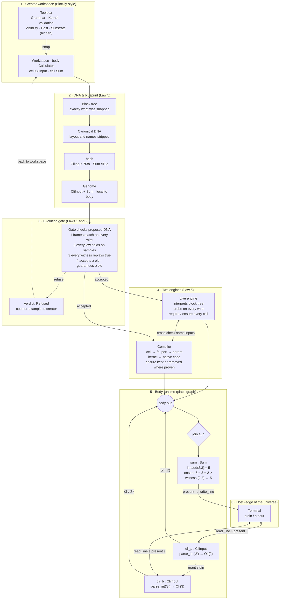

# JoInn Calculator Primitives

**What it takes to build 2 + 3**

*Part I applied to the §12 reference example · theory only, no implementation implied*

Author: AJ · Draft 0.1 companion · September 17, 2026

> Status tags follow the theory doc: **DECIDED**, **PROPOSED**, **OPEN**. Everything new in this note is **PROPOSED** until adopted.

A calculator body with two cell blueprints:

- **CliInput** turns a typed line into an integer.
- **Sum** adds two integers.

This note lists the hard-coded primitives each cell needs, shows how they snap together like Blockly blocks, and follows them through the full stack from the creator's workspace to the terminal.

| Count | What |
|---|---|
| **24** | primitives used |
| **2** | cell blueprints (CliInput, Sum) |
| **3** | cell instances (cli_a, cli_b, sum) |
| **1** | body (Calculator) |

```text
$ joinn run calculator
a: two
   refused at membrane: "two" is not in ℤ
a: 2
b: 3
2 + 3 = 5
```

---

## 1. The toolbox: 24 primitives in six drawers

In Blockly, the toolbox is a flyout of block shapes and the workspace checks whether shapes fit. JoInn's toolbox works the same way, but it has two drawers Blockly doesn't have: **Validation** (Law 1) and **Substrate** (identity and runtime). Every primitive is hard-coded in Rust. Creators never write one; they snap them together. **PROPOSED**

### Grammar (6): the block shapes

What can hold what, and what can snap to what.

| Primitive | Role |
|---|---|
| `body` | The one true container. Holds the genome and the body bus. |
| `cell` | C-shaped block with six compartment sockets. |
| `port` (in \| out) | Typed socket on the membrane. The only way in or out. |
| `wire` | Link from an out-port to in-ports within one body. |
| `frame` (ℤ, Text) | The context truth is judged in. Built-in frames: ℤ (unbounded) and Text. |
| `literal` | A constant field, such as the prompt `"a: "`. |

### Kernel (5): pure operations

They compute, but they have no membrane, no laws and no face.

| Primitive | Opposite / note |
|---|---|
| `int.add` | `int.sub` |
| `int.sub` | `int.add` |
| `int.eq` | The truth test every law and check reduces to. |
| `text.parse_int` | Text → Verdict⟨ℤ⟩. Opposite: `int.format` (one-way; see §7) |
| `int.format` | ℤ → Text. Opposite: `text.parse_int` |

### Validation (5): opposition as blocks

Blockly has no equivalent.

| Primitive | Role |
|---|---|
| `require` | What an in-port accepts. Checked on every message. |
| `ensure` | What an out-port guarantees. Checked on every result. |
| `law` | A property that must hold on sampled inputs in the frame. Checked at the gate. |
| `witness` | A recorded true result. Every future version must replay it. |
| `verdict` (Ok \| Refused) | What validation returns. A refusal is a value, not a crash. |

### Visibility (2): both halves of "able to be seen"

| Primitive | Role |
|---|---|
| `present` | Show a value. Doesn't know what a terminal or widget is; the host decides. |
| `probe` | Observability tap: the live engine shows each message on its wire. |

### Host (2): side effects

They can only be bound to a membrane port, never used inside an engine.

| Primitive | Opposite |
|---|---|
| `host.read_line` | A stream of lines from stdin. Opposite: `host.write_line` |
| `host.write_line` | Write a line to stdout. Opposite: `host.read_line` |

### Substrate (4): invisible

No blocks in the toolbox. The platform uses them to give blocks identity and life.

| Primitive | Role |
|---|---|
| `hash` | Content address of canonical DNA (Law 5). One-way by design. |
| `message` | Envelope crossing a membrane: value + frame + origin. |
| `join` | Fire a cell once all of its required in-ports hold messages. |
| `grant` | Hand a capability (stdin) to one cell. Opposite: revoke. |

> A 25th primitive exists but costs nothing here: `slot` (Storage). Neither cell stores anything, so both Storage sockets stay empty. That's the zero-cost compartment idea from §4.3 of the theory.

---

## 2. The workspace: snapping the two cells together

Each cell is one C-shaped `cell` block with six sockets in the order of theory §4.2. Statement blocks snap into sockets; value blocks `( … )` plug into other blocks. A wire only snaps when frames match, which is the first and cheapest opposition.

### cell CliInput  ·  dna 7f3a (illustrative)

```text
┌─ cell CliInput ───────────────────────────────────────────────┐
│ DNA         frame (Text) → (ℤ)                                │
│ MEMBRANE    port in  line : Text  ⟵ (host.read_line)          │
│             port out value : ℤ                                │
│             literal  prompt = "a: "          ← per instance   │
│ STORAGE     ┄ empty · zero-cost ┄                             │
│ ENGINE      value ← (text.parse_int (line))                   │
│ VALIDATION  require line ≠ ""                                 │
│             law     (int.eq  parse(format n), n)              │
│             witness "2" → 2                                   │
│             ensure  value ∈ ℤ                                 │
│ VISIBILITY  present prompt                                    │
│             present refusal reason                            │
│             probe   value                                     │
└───────────────────────────────────────────────────────────────┘
```

- The prompt is set per instance, so cli_a and cli_b share one DNA hash.
- If parsing fails, the verdict is **Refused** and nothing crosses the out-port. Immunity at the smallest scale.

### cell Sum  ·  dna c19e (illustrative)

```text
┌─ cell Sum ────────────────────────────────────────────────────┐
│ DNA         frame (ℤ)                     later extended: ℚ   │
│ MEMBRANE    port in  a : ℤ                                    │
│             port in  b : ℤ                                    │
│             port out sum : ℤ                                  │
│ STORAGE     ┄ empty · zero-cost ┄                             │
│ ENGINE      sum ← (int.add (a) (b))                           │
│ VALIDATION  require a, b ∈ ℤ                                  │
│             ensure  (int.eq (int.sub sum, b) a)               │
│             law     identity:     add(a, 0) = a               │
│             law     commutative:  add(a, b) = add(b, a)       │
│             witness (2, 3) → 5                                │
│ VISIBILITY  present (int.format) "a + b = sum"                │
│             symbolic form on/off                              │
│             probe   sum                                       │
└───────────────────────────────────────────────────────────────┘
```

- Two required in-ports tell the body bus to use `join`. No block needed.
- The frame extends from ℤ to ℚ later. That's the path-of-truth story from §12.

---

## 3. Full stack: from snapped blocks to a line on the terminal

Six layers. Build time flows down through the first four; run time lives in the last two. Every one of the 24 primitives is used at exactly one layer.



### Primitives at each layer

| Layer | Primitives |
|---|---|
| 1 · Creator workspace | `body` `cell` `port` `wire` `frame` `literal` |
| 2 · DNA & blueprint | `hash` |
| 3 · Evolution gate | `law` `witness` `int.eq` `verdict` |
| 4 · Two engines | `probe` `require` `ensure` `int.add` `int.sub` `text.parse_int` `int.format` |
| 5 · Body runtime | `message` `join` `grant` |
| 6 · Host | `present` `host.read_line` `host.write_line` |

*Hash values are placeholders.*

---

## 4. Run-time trace: one run, including a refusal

What happens when the user types `two`, then `2`, then `3`. The steps follow the order messages actually move.

| # | Where | Primitives | What happens |
|---|---|---|---|
| 1 | body bus → cli_a | `grant` | The bus hands the stdin capability to cli_a, the first CliInput declared in the body. |
| 2 | cli_a → host | `present` `host.write_line` | The prompt `a: ` appears. |
| 3 ✗ | host → cli_a membrane | `host.read_line` `require` `text.parse_int` `verdict Refused` | `"two"` isn't in ℤ. The reason is presented and nothing enters the body. |
| 4 ✓ | host → cli_a → body bus | `text.parse_int` `ensure` `message` `wire` | `"2"` becomes Ok(2) and leaves as ⟨2 : ℤ⟩. |
| 5 | body bus → cli_b | `grant` | The capability moves to cli_b. Ordering comes from who holds stdin, not from timestamps. |
| 6 ✓ | host → cli_b → body bus | `host.read_line` `text.parse_int` `message` | `"3"` becomes ⟨3 : ℤ⟩. |
| 7 | body bus → sum membrane | `join` `require` | Both required in-ports now hold messages, so sum fires. |
| 8 ✓ | sum engine + validation | `int.add` `int.sub` `int.eq` `ensure` `witness` | 2 + 3 = 5. Opposition: 5 − 3 = 2 ✓. The result joins the testimony. |
| 9 | sum → host | `int.format` `present` `host.write_line` | `2 + 3 = 5` is printed. In the creator it would be a widget instead, with no change to the DNA. |

---

## 5. Opposition, by when it runs

This example splits Law 1 by timing. Each check opposes a different kind of untruth, and each fires at a different moment. **PROPOSED**

| When | Check | What it does |
|---|---|---|
| At snap time | **frame on a wire** | Blockly already does this: a Text port won't snap into a ℤ port. It's the cheapest opposition, and the only kind Blockly has. |
| At the gate (design time) | **law** | Sampled properties, such as commutativity. They run when DNA changes, not on every call, so they cost the finished app nothing. |
| Every message (run time) | **require / ensure** | The contract at the membrane, and the only opposition that can see real user data. That's where `"two"` gets caught. |
| Forever (history) | **witness** | Testimony. When Sum grows into ℚ, the gate replays (2, 3) → 5 and refuses any version that changes it. |

---

## 6. Reference: every primitive, its opposite, its use, and its Blockly analog

The last column is the point. Blockly gives you shapes that fit together. Every row marked **none** is something JoInn has to add for "easy" to also be robust.

| Primitive | Opposite | In CliInput | In Sum | Stack layer | Blockly analog |
|---|---|---|---|---|---|
| **Grammar** | | | | | |
| `body` | — | holds all three instances | holds all three instances | Workspace, runtime | Workspace |
| `cell` | — | ✓ | ✓ | Workspace, compiler (→ fn) | Procedure definition block |
| `port` | in ⟷ out | line in, value out | a, b in · sum out | Membrane | Input / output connection |
| `wire` | — | value → bus | bus → a, b | Workspace, body bus | Connection |
| `frame` | narrow ⟷ extend | Text → ℤ | ℤ | Workspace, gate | Connection check string (without laws) |
| `literal` | — | prompt | — | Workspace | Field |
| **Kernel** | | | | | |
| `int.add` | int.sub | — | engine | Engine | Arithmetic block |
| `int.sub` | int.add | — | ensure | Validation | Arithmetic block |
| `int.eq` | ≠ | law | ensure, law | Gate, validation | Compare block |
| `text.parse_int` | int.format (partial) | engine | — | Engine | Text → number block |
| `int.format` | text.parse_int | law | present | Visibility, gate | Join text block |
| **Validation** | | | | | |
| `require` | ensure | line ≠ "" | a, b ∈ ℤ | Membrane, in | **none** |
| `ensure` | require | value ∈ ℤ | sum − b = a | Membrane, out | **none** |
| `law` | counter-example | parse ∘ format = id | identity, commutative | Gate | **none** |
| `witness` | changed answer | "2" → 2 | (2, 3) → 5 | Gate, blueprint history | **none** |
| `verdict` | Ok ⟷ Refused | refuses "two" | Ok(5) | All validation | **none** |
| **Visibility** | | | | | |
| `present` | — | prompt, refusal | "2 + 3 = 5" | Visibility → host | Print block |
| `probe` | — | value | sum | Live engine | Block highlighting while stepping |
| **Host** | | | | | |
| `host.read_line` | write_line | bound to `line` | — | Host | Prompt block |
| `host.write_line` | read_line | via present | via present | Host | Print block |
| **Substrate** | | | | | |
| `hash` | one-way | DNA identity | DNA identity | Blueprint | **none** (XML / JSON save) |
| `message` | — | sends ⟨n : ℤ⟩ | receives two | Body bus | **none** (generated code) |
| `join` | — | — | fires on a ∧ b | Body bus | **none** |
| `grant` | revoke | holds stdin in turn | — | Body bus, host | **none** |

---

## 7. Ideas the calculator pushed out

> **A primitive can compute. Only a cell can be trusted and seen.**

That's the working line between the two layers. `int.add` and a Sum cell do the same arithmetic. The cell adds a membrane, laws, witnesses and a face. **PROPOSED**

### Inverse-or-declare admission rule

A kernel primitive is admitted only with its opposite, or with an explicit "one-way" declaration (like `hash`). Opposition isn't always symmetric: `parse(format n) = n` always holds, but `format(parse s) = s` fails for `"007"`. The primitive declares which direction is true.

*Cost:* every new primitive needs more design work up front. That's intended.

### Reference kernel beside the native kernel

Law 6 pushed down a level. Each arithmetic primitive also carries a slow, obviously-true definition (repeated successor on ℤ). The live engine can run it, and the fast native version is witnessed against it. The truly irreducible set shrinks to `zero`, `succ`, `pred` and `eq`.

*Cost:* the reference path is far too slow for big numbers, so it's only used for sampling.

### Sum as a hyperedge, not a function

Treat Sum as a three-way constraint {a, b, sum} with the law a + b = sum. Direction becomes a question of which ports are known: give it a and b and you get the sum; give it sum and b and it subtracts. Subtraction stops being a separate cell. It's the same DNA, solved for a different unknown, so opposition becomes structure. Prior art: Sussman and Radul's propagator networks.

*Cost:* the compiler has to choose a direction for each instance, and two unknowns means no answer.

### Ordering by capability, not clock

Two CliInput cells share one stdin. Instead of timestamps, the body passes the `grant` along, and whoever holds stdin reads next. This is an early answer to R11 (time) that also serves R12 (trust): cells can't read what they weren't granted.

*Cost:* a cell that never returns its grant stalls the body. That needs R9 supervision.

### The terminal is a host, not a cell

`present` never names stdout. The CLI host turns it into a line, and the visual creator turns the same call into a widget. One Sum blueprint serves both engines and every surface, which keeps the "side effects at the membrane" proposal honest.

*Cost:* hosts become a new platform concept that the theory doc doesn't define yet.

### DNA vs. expression environment

cli_a and cli_b share one DNA hash but show different prompts. As in biology, the same genome behaves differently in a different environment. Instance literals would be expression, not DNA, so changing a prompt never triggers the evolution gate.

*Cost:* we need a rule for where expression stops and DNA starts (R2, R5).

---

## 8. New questions for the backlog

- **R6 · primitives.** Is `text.parse_int` really a primitive, or is it a cell built from a digit primitive? Minimal says cell; practical says primitive. **OPEN**
- **R11 · time.** What does `join` do if `a` arrives twice before `b`: keep the latest, queue both, or refuse? **OPEN**
- **R7 · lone bodies.** Calculator is the only body in its universe. Is it an implicit system of one, the same way a lone cell might be a body of one? **OPEN**
- **Immunity.** Can a `Refused` verdict ever cross a body boundary, or does it always stay inside the body that produced it? **OPEN**
- **R13 · naming.** These are "blocks" in the Blockly sense, which is a third meaning next to k-blocks and the biomimicry `blocks` linker. **OPEN**

---

*JoInn Architecture and Theory, Part I (Draft 0.1) applied to its §12 reference example. Theory only: no implementation implied. New items are PROPOSED until adopted.*
