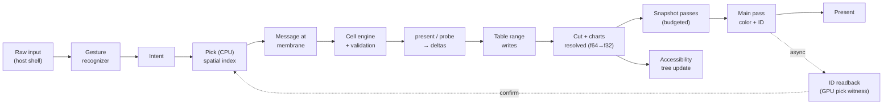

# JoInn Visual Host

**Part II — Wrapping wgpu so the JoInn universe can be seen and touched**

*Theory only · no implementation implied*

Author: AJ · Draft 0.1 · September 17, 2026

> Status tags follow Part I: DECIDED, PROPOSED, OPEN. The proposals in this part were reviewed and adopted on September 17, 2026, so what remains is either **DECIDED** or **OPEN**. New research items R14–R16 are tracked in §22.

> **Thesis.** Every mainstream GPU UI renderer throws structure away before the GPU sees it: the widget tree is flattened into anonymous piles of shapes. The JoInn Visual Host does the opposite. It keeps the **place graph, the link graph, and the membrane rules alive on the GPU**, and lets the architecture's laws drive rendering. That structure-preserving wrap is the part of JoInn that is new at the graphics level, and it is what this part defines.

---

## 0. How to Read This Part

Part I defined the cell, the body, the laws, and the Visibility compartment (`present` and `probe`). *JoInn Calculator Primitives* then showed that `present` never names a terminal or a widget: **the host decides**. It also flagged that "hosts become a new platform concept that the theory doc doesn't define yet."

This part defines one host: the **Visual Host**, which turns `present` and `probe` into pixels on desktop, mobile, and web, and turns touches, clicks, and keys back into messages at a membrane. It is built on the `wgpu` crate.

| Section | Covers |
|---|---|
| §1–3 | What the Visual Host is, how the laws apply to it, and the decisions it rests on |
| §4–6 | The two wraps, the layer model, and the visual primitives |
| §7–11 | The GPU Body Model: the unique core |
| §12–14 | The render tick, perception (picking, accessibility, input), and expression across devices |
| §15–17 | Platforms, the two rendering engines, and visual truth |
| §18–21 | The capability surface, invariants, borrowed vs. built, and prior art |
| §22–23 | Open questions and glossary |

---

## 1. What the Visual Host Is

The Visual Host is the edge of the universe where JoInn meets a screen and a person.

- **Outward** (`present`, `probe`): cells describe how they want to be seen; the host draws it.
- **Inward** (input): raw input becomes an **intent**, the intent is resolved to an address in the universe, and a message arrives at the membrane of the cell that owns that address.

The host is not a cell. Like the terminal host in the calculator note, it is the environment cells are expressed into. **DECIDED**

---

## 2. The Laws Applied to Rendering

Part I's laws are not suspended at the graphics layer. Each one produces a concrete rendering rule.

| Law | Rendering consequence | Section |
|---|---|---|
| **1 · Opposition in all things** | Every visual primitive declares its inverse: draw ↔ pick, transform ↔ inverse transform, visual ↔ accessibility node. A primitive with no inverse is untrue and not admitted. | §6, §17 |
| **2 · Path of truth** | What a cell *means* on screen (its pick map and accessibility tree) is witnessed. Evolution may restyle a cell but may not remove or change what it meant. | §17 |
| **3 · Fractal semantic zoom** | Rendering is a **cut** through the place graph and the active lens, chosen each tick by projected size. Depth comes from the view, not the data. | §10 |
| **4 · Consistent containers** | Each container draws and routes its links the same way everywhere, and every device maps to one shared intent vocabulary. | §11, §14 |
| **5 · Identity follows content** | Pipelines are keyed by DNA hash; snapshots are keyed by DNA hash + state hash. Identical content renders once. | §10, §16 |
| **6 · Two engines, one truth** | An embryo renderer (live engine) and an adult renderer (compiler) must agree. The CPU pick and the GPU pick must agree. | §13, §16 |

---

## 3. Decisions This Part Rests On

| # | Decision | Status |
|---|---|---|
| D1 | Graphics use the `wgpu` crate. | **DECIDED** |
| D2 | One app runs on desktop, mobile, and web with a similar experience on each. | **DECIDED** |
| D3 | The primitives that build cells are wrapped from wgpu; the cell/body/hyperedge structure is the functionality the wrap exposes. | **DECIDED** |
| D4 | The structure-preserving GPU approach (the GPU Body Model, §7) is treated as JoInn's unique contribution at the graphics level. | **DECIDED** |
| D5 | The web targets **WebGPU only**. No WebGL2 backend is built or maintained. | **DECIDED** |
| D6 | "Similar experience" means same meaning and intents, not same pixels. | **DECIDED** |
| D7 | Devices without WebGPU get a minimal *expression* (native app offer, read-only snapshot view, or CPU 2D draw), not a second GPU backend. | **DECIDED** |
| D8 | Cells never touch wgpu types. | **DECIDED** |
| D9 | GPU memory is phenotype, never genotype: everything on the GPU can be regrown from DNA + storage. | **DECIDED** |
| D10 | **Exclusive membership within a lens:** every body belongs to exactly one system, and every system to exactly one galaxy. Systems are crossed only by hyperedges. Other groupings are other lenses (Part I §5.2, §7). | **DECIDED** |

> **Why D5 is safe.** As of September 2026, WebGPU ships by default in Chrome and Edge (Windows, macOS, ChromeOS, Android 12+), in Safari 26 (macOS, iOS, iPadOS, visionOS), and in Firefox on Windows and Apple Silicon Macs. The remaining gaps are Linux browsers (partial in Chrome, Nightly-only in Firefox), Firefox on Android, older Android devices, and Windows on ARM in Chrome. Those gaps are closing, and the native builds cover Linux better anyway.

---

## 4. The Two Wraps

"Wrap wgpu into primitives" hides two different jobs. Merging them would tie every published blueprint to one graphics library.

```text
                 CELLS  (DNA · membrane · storage · engine · validation · visibility)
                   │   present / probe
                   ▼
   ┌───────────────────────────────────────────────────────────┐
   │  UPWARD WRAP — visual vocabulary + GPU Body Model API     │   ← what creators and cells see
   │  Shape · Text · Image · Region · Port · Link · Chart      │
   │  Grow · Link · Express · Move · Perceive · Remember · …   │
   └───────────────────────────────────────────────────────────┘
   ═══════════════ renderer boundary: cells never cross it ═══════════════
   ┌───────────────────────────────────────────────────────────┐
   │  DOWNWARD WRAP — organelles over wgpu                     │   ← platform authors only
   │  SDF shapes · glyph atlas · images · curves · snapshots   │
   │  ID target · composite                                    │
   └───────────────────────────────────────────────────────────┘
                   │
                   ▼
                 wgpu  →  Vulkan · Metal · DX12 · WebGPU
```

Reasons to keep them apart:

1. **wgpu has frequent breaking releases.** Blueprints shared by the community must survive them. Only the downward wrap changes.
2. **Other hosts.** Engineering calc packages need PDF and print. A headless test host needs no screen at all. The same vocabulary feeds every host; only one of them uses wgpu.
3. **Accessibility and testing** must read the same description the GPU draws. A pixel buffer can't supply it.

**DECIDED**

---

## 5. The Layer Model

```text
L5  Creator                 the visual app creator — itself built from cells
L4  Composition             lenses, layout, link routing, semantic zoom cut
L3  Cell presentation       membrane + ports + interior + expression bands
L2  Visual vocabulary       Shape · Text · Image · Region · Port · Link · Chart
    + capability surface    Grow · Link · Express · Move · Perceive · … (§18)
═══════════════════════════ renderer boundary ═══════════════════════════
L1  GPU Body Model          universe tables on the GPU (§7) + organelles
─────────────────────────────────────────────────────────────────────────
L0  Host shells             window/surface · event loop · device · IME · a11y · clipboard · lifecycle
      ├─ desktop   Vulkan / Metal / DX12
      ├─ mobile    Android Vulkan · iOS Metal
      └─ web       wasm + WebGPU
```

### L0 — Host shells

The only layer that differs by platform. It owns the window or canvas, the event loop (winit on all three), the wgpu instance, adapter, device and queue, text input, accessibility bridge, clipboard, and lifecycle events. Its job is to present every platform as **one environment** (§14).

### L1 — GPU Body Model and organelles

The structure-preserving core (§7–11), plus a small fixed set of GPU pipelines called **organelles**:

| Organelle | Role |
|---|---|
| **SDF shape** | Rounded rects, circles, capsules, strokes. Resolution-independent, so sharp at any zoom. |
| **Glyph** | Text from a shared glyph atlas. Shaping happens on the CPU with a borrowed crate. |
| **Image** | Textures: icons, pictures. |
| **Curve** | Wires and hyperedges as SDF curve segments. |
| **Snapshot** | Draws a body into an atlas page for reuse when collapsed or unchanged. |
| **Composite** | Final blend and present. |

All organelles are instanced and read the same universe tables. Keep the set small; growth belongs in L2–L5.

### L2–L5

Described in §6 (vocabulary), §10–11 (zoom and links), and §18 (the surface the creator builds on).

---

## 6. The Visual Vocabulary

These are the visual primitives a cell's Visibility compartment emits through `present`. They are retained and declarative. They are never draw calls.

| Primitive | What it describes | Its inverse (required, Law 1) | Accessibility face |
|---|---|---|---|
| **Shape** | Geometry + fill/stroke in the cell's chart | Inside test: point → covered or not | Role inherited from the cell |
| **Text** | Content + style | Point → character index; caret → point | Text value |
| **Image** | A texture reference + bounds | Point → covered; **alt text required** | Image with description |
| **Region** | An input area; may draw nothing | Itself: pick-only | Action |
| **Port** | Membrane opening where a wire or hyperedge attaches | Point → port address | Connection point |
| **Link** | How a wire or hyperedge is drawn | Point → distance along curve → link id | Relation between nodes |
| **Chart** | A local coordinate system | The matrix inverse must exist (no zero scale) | None; structural only |

**Naming note.** Part I already uses *frame* for the context truth is judged in (ℤ, AISC 360-22), and the calculator note has a `frame` primitive. So the coordinate primitive is called **Chart**, as in a coordinate chart on a manifold. It also fits Part I's topological view of dimension. **DECIDED**

### Relation to the calculator primitives

| Calculator primitive | What the Visual Host does with it |
|---|---|
| `present` | Emits vocabulary primitives into the cell's slot in the GPU tables |
| `probe` | Draws message pulses travelling along wires (live engine; optional in the adult) |
| `port` (in \| out) | Becomes a **Port** record; the only place a Link can attach |
| `wire` | An intra-body **Link**, drawn in the body's chart and clipped by the body membrane |
| `verdict Refused` | Flashes at the membrane that refused: immunity made visible |

---

## 7. The GPU Body Model

This is the heart of the part and the functionality D3 says must be wrapped and available.

Instead of a flat primitive list rebuilt every frame (the approach of GPUI and most immediate-mode UIs), the GPU holds a **mirror of the universe**: tables whose rows are bodies, cells, ports, and links. Cells update their own rows when their state changes. Nothing is rebuilt from scratch.

### 7.1 The tables

Record layouts below are **illustrative**. Sizes assume WGSL alignment rules with explicit padding.

**Body table** (one row per body):

| Field | Type | Purpose |
|---|---|---|
| `chart` | 2×3 f32 | Camera-relative transform, rewritten each tick for visible bodies only (§9) |
| `half_extent` | vec2 f32 | Body bounds |
| `membrane` | vec4 f32 | Membrane shape parameters (kind encoded in `flags`) |
| `genome` | u32 | Index into the genome table (DNA-hash-keyed styles and variants) |
| `snapshot` | u32 | Atlas slot of the current snapshot, or none |
| `generation` | u32 | Increments on any visible change; snapshots compare against it |
| `band` · `flags` | u8 · u8 … | Current expression band; membrane kind; selection state |

**Cell table** (one row per cell):

| Field | Type | Purpose |
|---|---|---|
| `body` | u32 | Owning body slot. Exactly one (Part I §5.1). |
| `local` | vec4 f32 | Offset + scale inside the body chart |
| `membrane` | vec4 f32 | Cell membrane parameters |
| `visual` | u32 · u32 | Offset and count into the instance buffers |
| `generation` | u32 | Stale-pick guard (§13) |
| `band` · `flags` | u8 · u8 … | Expression band; refusal flash; probe on/off |

**Port table:** owning cell, position on the membrane (side + parameter along it), direction (in \| out), link rule (which containers it may link through).

**Link table:** kind (wire \| hyperedge), an ordered flag, a style, and a range into the incidence array. Each incidence entry carries a tail/head mark, so zero tail members is a pure relation, one is a sender, and several are a fan-in (§11.1).

**Incidence array:** a flat list of port ids in compressed sparse row form. A wire has two entries; a hyperedge has any number. This is what lets a hyperedge be drawn as a hyperedge instead of as pairwise wires (§11).

**Instance buffers** (one per organelle): shape, glyph, image, and curve instances. Every instance carries its owning cell slot, so a shader can walk instance → cell → body → chart.

### 7.2 Bind group layout by rate of change

WebGPU's core limits allow 4 bind groups and 8 storage buffers per shader stage. The model fits within them.

| Group | Contents | Changes |
|---|---|---|
| **0 · Tick** | Camera, time, environment signals | Every tick |
| **1 · Universe** | Body, cell, port, link, incidence tables | When deltas arrive |
| **2 · Genome** | Style table, glyph atlas, image atlas, snapshot atlas, samplers | When a genome or atlas changes |
| **3 · Pass** | Pass-specific data (snapshot target, ID pass flags) | Per pass |

### 7.3 Slots, generations, and deltas

- Rows live in **generational slots**: a handle is (slot, generation). A freed slot is reused with a new generation, so an old handle can never address a new cell.
- A cell's `present` output becomes a **delta**: which rows and instance ranges changed.
- Deltas are coalesced per tick into range writes on the queue. Tables grow by doubling; growth rebuilds the Universe bind group.
- Native: deltas cross a channel from the universe to the render thread. Web: the same delta protocol runs synchronously. **One protocol, two schedules.**

### 7.4 GPU memory is phenotype (D9)

Nothing lives only on the GPU. Tables, atlases, and snapshots are all **derived** from DNA + storage + the active lens. When a device is lost, a mobile surface is destroyed on suspend, or a tab is backgrounded, the host discards the GPU state and **regrows** it. This is R9 (life cycle) at the renderer level: the visual dies and regrows from its genome.

---

## 8. What the Place-Graph Decisions Buy the Renderer

Decisions Part I made for philosophical reasons turn into rendering advantages. A tree-based UI framework cannot get these, because its rules do not guarantee them.

| Part I decision | Rendering consequence |
|---|---|
| **DNA is local to a body** (§8.1) | Cells of one body share styles, glyph sets, and shader variants. **The body is the natural draw batch.** No sort heuristics are needed to find batches. |
| **Only cells-in-body is true nesting; bodies do not nest** (§5.1) | Clipping depth is bounded. A fragment tests at most two membranes (its body's, and its cell's if the cell clips its interior), computed as SDFs in the shader. There is no unbounded stencil or scissor stack. |
| **A cell belongs to exactly one body** (§5.1) | Every pixel has exactly one owner, so picking is unambiguous. |
| **Cells talk only within their body; otherwise through linked containers** (§6.1) | Links attach only to Ports, and Ports exist only where the container's rules allow. **The renderer cannot draw a connection the architecture forbids.** The UI is a validator you can see. |
| **Systems and galaxies are link structures** (§5.2) | They never clip and never own pixels directly. When collapsed they are lens nodes (§10). |
| **Within a lens, a body is in exactly one system and a system in exactly one galaxy** (§5.2, §7) | Every body has exactly one position in the active lens's chart chain. The lens is a tree, so layout, the zoom cut, and hyperedge rerouting never have to choose between duplicate placements. |
| **Blueprint reuse, not shared instances** (§5.1) | Identical blueprints with identical state share pipelines and snapshots through Law 5 keys. |

**DECIDED**

---

## 9. Charts and Deep Zoom

### 9.1 The problem

GPUs work in 32-bit floats. Zoom far enough from universe to galaxy to system to body to cell to a digit inside a cell, and world coordinates lose precision: shapes jitter, then collapse onto each other. An infinite fractal zoom breaks any renderer that stores world positions on the GPU.

### 9.2 The answer: a chain of charts

Every level that has a position gets a **Chart**, a local coordinate system relative to its parent:

```text
universe chart
  └─ galaxy chart      ┐
       └─ system chart ┘  from the ACTIVE LENS (view, not data)
            └─ body chart    ┐
                 └─ cell chart ┘  from the PLACE GRAPH (data)
```

Bodies do not nest, so the upper part of the chain comes from the active lens's layout, and only the lower part comes from the place graph. This is Part I's principle made geometric: **real structure stays shallow; depth is provided by the view.**

Because membership is exclusive within a lens (D10), the chain from any body up to the universe is unique. Switching lenses swaps the upper part of every chain; the lower part never changes.

### 9.3 Rules

1. **The camera is anchored to the deepest chart that contains the view center**, never to the universe.
2. Each tick, the chart chain from the anchor to every visible body is resolved on the CPU in f64 and uploaded as small, camera-relative f32 transforms.
3. **Zoom is stored as an integer level plus a fractional part** (like map tiles), so zoom depth is effectively unbounded.
4. When the view center crosses into a child or parent chart, the anchor is **rebased**. Nothing on screen moves.
5. **The GPU never sees a world coordinate.**

**DECIDED**

---

## 10. Semantic Zoom: the Cut, Bands, Lenses, and Snapshots

### 10.1 Expression bands

Each body and cell has a small set of visual expressions, chosen by **projected size on screen**. Thresholds are illustrative and tuned per environment (§14).

| Band | Projected size | What is drawn |
|---|---|---|
| **Dot** | < 4 px | A colored point. Presence only. |
| **Glyph** | 4–32 px | Icon + membrane outline |
| **Summary** | 32–240 px | Membrane, ports, key values; body drawn from its snapshot |
| **Full** | > 240 px | Live cells, wires, probes, editable interiors |

**Hysteresis:** the threshold for moving up a band is about 20% higher than the threshold for moving down. Zoom-in and zoom-out are opposites with separate thresholds, so the display never flickers at a boundary (Law 1).

### 10.2 The cut

Each tick, the host walks the active lens and the place graph and selects the **cut**: the set of nodes that will be drawn as themselves.

- A system or galaxy whose projected size is below its Summary threshold collapses to a **lens node**.
- A body above the cut is drawn from its snapshot or glyph; a body below it is drawn from its live cells.
- Transitions between bands crossfade and animate, so the user sees that the dot they zoomed into *is* the body.

This is the same idea as Unreal's Nanite choosing a cut through a cluster DAG by screen-space error. JoInn applies it to meaning instead of triangles. The first implementation runs on the CPU; a GPU compute version is optional for very large universes. **DECIDED**

### 10.3 Lens nodes

A collapsed system is drawn as a lens node: its name, a mosaic of member-body snapshots or a single glyph, and the hyperedges that leave it. From outside, a hyperedge shows only "goes to that system" (Part I §7). Hyperedge endpoints are **rerouted** from inner ports to the lens node boundary.

### 10.4 One body, one system (R8)

**Rule.** Within one lens, every body belongs to exactly one system, and every system to exactly one galaxy. A body that several systems *use* is still *in* only one; the others reach it by hyperedge through its owning system's contract. **DECIDED**

The rule is fractal: exclusive membership holds at every level (cell → body in the place graph; body → system and system → galaxy in the lens).

**"Used by" is a link fact, not a membership fact.**

| Looks like two systems | Modeled as |
|---|---|
| Customer record used by Billing and Authentication | Owned by Identity; Billing links to it |
| A572-50 material properties used by design checks, calc report, and fabrication BOM | Owned by a Materials system; the other three link to it |
| Audit log that watches everything | Its own Audit system; every other system has a hyperedge to it |
| Units or calculator body used everywhere | A small shared system (a "shared kernel") that others link to |

**Where "more than one system" is real: lenses.** Grouped by function, a Customer body sits in Identity; grouped by deployment, in Server; grouped by team, in Platform Team. A body can be in several systems *across* lenses, never *within* one. Part I's reason for avoiding a forced tree still holds: each lens is a tree, but many lenses can exist over the same bodies, and cross-cutting concerns are hyperedges.

**A body that seems to serve two systems is usually two bodies.** The pancreas belongs to both the digestive and endocrine systems, but its digestive (acinar) and endocrine (islet) parts are different cell populations. In JoInn, the answer is differentiation into two bodies (R1), not shared membership.

**Rendering consequence.** A body is laid out and drawn exactly once per lens. No alias glyphs or duplicate placements are needed. Hyperedges arriving from other systems are rerouted to the collapsed system's boundary (§10.3).

**Cost.** For a truly shared body, some system must own it, and that choice can feel arbitrary. The discipline pays back under Law 1: the owner's contract becomes the single gate every user of the body passes through. How an owner is chosen when it isn't obvious is **OPEN**.

### 10.5 Snapshots

- A body in the Glyph or Summary band draws from an atlas snapshot instead of its cells.
- A snapshot is keyed by **(DNA hash, state hash, band, scale bucket)**. Two bodies from the same blueprint in the same state share one snapshot (Law 5).
- A snapshot is invalid when the body's `generation` no longer matches.
- Re-rendering snapshots is **budgeted per tick**, which is a first concrete use of R10 (metabolism). Over budget, stale snapshots stay on screen a little longer.

---

## 11. Links: Wires and Hyperedges

Part I and the calculator note give two kinds of connection. The Visual Host draws them differently because they live in different graphs.

| | **Wire** | **Hyperedge** |
|---|---|---|
| Graph | Inside one body (body bus) | Link graph between bodies |
| Endpoints | Two ports, out → in | Any number of ports, touched never crossed (§11.1) |
| Drawn in | The body chart | The lens chart |
| Clipped by | The body membrane | Nothing |
| Visible from | Full band of that body | Every band, rerouted at lens nodes |
| Probe pulses | Yes (live engine) | Yes, at system scale (aggregated) |

### 11.1 Drawing a hyperedge as a hyperedge

Almost every node editor draws pairwise wires, which misstates what a hyperedge is. A hyperedge is **one entity incident to a set of ports**, and the host draws it as one thing.

#### The touch-only law

**A hyperedge touches ports. It never crosses a membrane. DECIDED**

If a connection enters a body and leaves on the other side, it is not one edge: it is **two pairwise edges with that body between them**. The membrane is the only place a cell meets the outside and a port is its only opening, so a line passing through a body would be a second, undeclared way in (Part I §6). Consequences:

- Routing always goes **around** membranes that are not members, never through them.
- A link whose geometry would cross a membrane is untrue and is refused (§19, V16).
- Transit is never drawn. What used to look like a hyperedge "passing through" a body is a chain, and a chain is drawn as pairwise edges, each with its own contract.

#### One form, two parameters

Every hyperedge is drawn the same way; two parameters in its record change the shape.

| Parameter | Values | Comes from |
|---|---|---|
| **Order** | none · ordered | Whether the incidence list is ordered in DNA |
| **Source** | tail members marked in the incidence list: zero, one, or many | Port direction (out = may be tail, in = may be head) |

Zero tail members is a pure relation ("these ports share this"). One tail is a sender. Several is a fan-in. Heads may be ordered or unordered independently.

| Order | Band | Drawn as |
|---|---|---|
| **None** | Far | **Region**: a soft tinted hull touching member ports or lens nodes |
| **None** | Middle | **Hub**: a star from a centroid knot out to each member |
| **None** | Near | **Bundle**: the hub's knot stretched into a trunk, with a leg to each member |
| **Ordered** | Any | **Spine**: the region narrowed to a line that passes each member in order, with a short stub touching each port and arrowheads along the spine |

Region, hub, and bundle are the same unordered edge drawn at increasing tightness; the bundle is a near-zoom style of the hub, not a separate kind. The spine is the same region stretched thin, with order shown along its length. Tail ports are drawn filled with an arrowhead leaving them; head ports are drawn hollow. With no tail members there are no arrowheads at all.

This zoom-dependent hyperedge form is JoInn's visual signature. **DECIDED**

#### Order is drawn only when it is true

An ordered spine asserts that the members *have* an order. Style may not add one: drawing a spine for an unordered edge states something false, which Law 2 forbids. The evolution gate treats a change from unordered to ordered as a change of meaning, not of style (§17.2).

#### What an order means

| Relationship | Expressed as |
|---|---|
| Turn-taking, priority, delivery order, passing a capability (the stdin `grant` of the calculator note) | **Ordered hyperedge**: members act in order; nothing is transformed between them |
| A pipeline where each stage transforms a value and hands it on | **A chain of pairwise wires or edges**: each hop is its own contract, checked at its own membrane |

An ordered hyperedge orders **access**. A chain composes **work**. Keeping them apart is what the touch-only law buys.

#### Under collapse

Because the edge only touches, an edge with several member ports inside one collapsed system **touches that lens node once**, whatever the member count; the member indices map to the node. A path that left a system and returned to it used to draw a visible loop at the system node; with touch-only that case cannot arise.

#### Picking and accessibility

A pick on a hyperedge returns (link id, member index) — the member index rides in the part channel of the ID target (§13.1). A screen reader reads an unordered edge as a set of related nodes, and an ordered edge as an ordered list ("member 2 of 4"), which is the accessibility face of the same order the spine draws.

### 11.2 Geometry

Curve geometry is generated on the CPU in the live engine and may move to a compute pass on capable devices. Segments are drawn by the Curve organelle as SDF curve instances, so they stay sharp at any zoom. Routing avoids the membranes of all non-member bodies, and by the touch-only law it never enters a member body either: a stub stops at the port. Spines are laid out to keep their drawn order monotonic where the layout allows, and to minimize crossings where it does not.

---

## 12. The Render Tick

The word *frame* is taken (truth context), so one pass of the render loop is called a **tick**.

### 12.1 Render on demand

A tick runs only when there is input, a running animation, or pending deltas. An idle universe draws nothing. This is required on mobile (battery and thermal limits) and good everywhere.

### 12.2 The loop



### 12.3 Passes per tick

| # | Pass | Target | Notes |
|---|---|---|---|
| 1 | *(optional)* Compute: cut, curve routing | Buffers | Only on devices whose limits allow it (§15.4) |
| 2 | Snapshots | Atlas pages | Dirty bodies in Glyph/Summary bands, within budget |
| 3 | Main | Color + **ID target** | Draw order: lens nodes → body membranes → cells by body → wires → hyperedges → overlays |
| 4 | Composite | Surface | Present |

SDF shapes antialias analytically in the shader, so the main pass does not need multisampling. That matters because an integer ID target cannot be multisample-resolved or blended.

---

## 13. Perception: Picking, Accessibility, Input

Drawing is half of Visibility. Perception is its opposite.

### 13.1 The ID target (draw ↔ pick)

The main pass writes a second render target in an unsigned-integer format. Each pixel stores **the address of its owner**:

| Channel | Holds |
|---|---|
| R | Body slot, or a lens node id (high bit set) |
| G | Cell slot |
| B | Port or part index (Region, Text run, or a link's member index) |
| A | Low bits of the cell generation (stale-pick guard) |

Reading one pixel back returns the full address of whatever is under the finger or cursor. Picking becomes the exact inverse of drawing, produced by the same pass. CAD tools use object-ID picking; storing an **architectural address that mirrors the place graph and the lens** is the new part.

### 13.2 Two pick witnesses (Law 6)

GPU readback is asynchronous and arrives a tick later, which is too slow for hover. So there are two pickers:

- **CPU pick:** a spatial index over visible bounds (Hilbert-curve indexing is a natural fit), immediate.
- **GPU pick:** the ID target, exact to the pixel and the SDF edge.

The CPU pick acts immediately; the GPU pick confirms it. **In debug builds, a disagreement is reported as a truth violation**: some primitive's declared inverse doesn't match what it drew. The two engines of Law 6 appear again at the scale of one pixel. **DECIDED**

### 13.3 Accessibility as the opposite of presentation

The accessibility tree is built from the **same cut** as the picture:

- Each visible cell is a node with the role, value, and actions its primitives declared.
- A lens node is a group with a summary label.
- **Zooming in, for a screen reader, is expanding a group.** Semantic zoom and tree navigation are the same operation.

Seen by eyes ↔ seen by a screen reader. A cell that draws something with no accessibility face fails its inverse contract (§17). **DECIDED**

### 13.4 Input becomes intent

Raw input differs by device. Cells never receive raw input; they receive **intents** (§14.3), already resolved to an address.

---

## 14. Expression: One Genome, Many Devices (R14)

### 14.1 Phenotype = Genotype × Environment

The calculator note already observed that cli_a and cli_b share DNA but show different prompts: expression, not DNA. The Visual Host generalizes this. A blueprint does **not** contain a phone layout and a desktop layout. It contains **expression rules** that respond to environment signals.

### 14.2 The environment body

The host shell presents the platform as an **environment body** at the top of the universe. It emits signals the way a tissue emits morphogen gradients:

| Signal | Examples | Typical expression response |
|---|---|---|
| Available space | Window size, split view, rotation | Band thresholds shift; bodies summarize sooner |
| Pointer precision | Fine (mouse, pen) · coarse (finger) | Ports get larger hit Regions; visuals may stay the same size |
| Hover present | Yes · no | Hover-only content moves to long-press |
| GPU tier | Core limits · extended limits | Compute paths on/off; snapshot budget |
| Power budget | Plugged in · battery · thermal throttle | Fewer animations; more snapshot reuse |
| Safe areas | Notches, soft keyboard | Chart of the root body inset |
| Text scale | OS font scaling | Glyph band thresholds shift |

### 14.3 One intent vocabulary

| Intent | Desktop | Touch | Pen |
|---|---|---|---|
| **Select** | Click | Tap | Tap |
| **Open / zoom in** | Double-click · Ctrl + wheel · trackpad pinch | Double-tap · pinch out | Double-tap |
| **Zoom out** | Ctrl + wheel · pinch | Pinch in | Two-finger pinch |
| **Pan** | Middle-drag · Space + drag · trackpad scroll | Two-finger drag | Two-finger drag |
| **Link** (port → port) | Drag from port | Long-press port + drag | Drag from port |
| **Inspect** | Hover (preview) · right-click | Long-press | Barrel button |
| **Undo / redo** | Ctrl+Z / Ctrl+Shift+Z | Three-finger swipe / on-screen control | On-screen control |

### 14.4 Expression rules

1. **Expression changes how, never what.** The set of intents a cell accepts and the accessibility tree it produces are identical in every environment. This is witnessed (§17).
2. **Hover may never carry meaning**, only previews. Everything reachable by hover is reachable another way.
3. **An intent exists only if it maps in every environment.**
4. **Progressive enhancement only.** Keyboard shortcuts and hover add speed, never capability.

**DECIDED**

---

## 15. Platforms

### 15.1 Desktop

- Native Vulkan, Metal, or DX12 through wgpu; winit windows.
- **Multiple windows are multiple cameras** onto the same universe, possibly at different zooms or lenses.
- Full keyboard, hover, precise pointer: enhancement, not extra meaning.

### 15.2 Mobile

- Android (Vulkan) and iOS (Metal) through wgpu; winit lifecycle events.
- **The surface is destroyed on suspend** and must be recreated on resume. By D9 this is routine: discard GPU state, regrow from the universe.
- Soft keyboards resize the viewport; safe areas inset the root chart.
- Thermal throttling makes render-on-demand mandatory.

### 15.3 Web

- wasm + **WebGPU only** (D5).
- Device setup is asynchronous; the host's startup is designed async from the first line.
- Threads are limited without cross-origin isolation headers. The delta protocol (§7.3) lets the same universe run on one thread or several. Rendering from a worker with an offscreen canvas is a later option.
- No system fonts: fonts ship with the app.
- Text input and screen readers need hidden DOM mirrors (an input element for IME, a DOM accessibility tree).
- wasm binary size is a real cost; the host shell stays lean.

### 15.4 GPU limit tiers

"Has WebGPU" does not mean "has large limits." Low-end phones report much lower limits, and a lower-tier compatibility mode for older GPUs is in development in browsers.

| Tier | Assumes | Enables |
|---|---|---|
| **Core** (baseline) | WebGPU core default limits: 4 bind groups, 8 storage buffers per stage, storage buffers readable in vertex and fragment stages | Everything required: tables, organelles, ID target, snapshots |
| **Extended** | Larger buffers, compute workgroups | GPU cut, GPU curve routing, larger snapshot budgets |

**Rule:** nothing required may exceed Core. A cell or body that needs Extended must **declare it in its genome**, and must express a reduced form when the environment says Core. **DECIDED**

Whether a Core tier can also cover browsers' compatibility mode (where vertex-stage storage buffers may be unavailable) is **OPEN**. If needed, per-instance data can move into vertex instance buffers without changing the upward wrap.

### 15.5 No WebGPU at all (D7)

A missing GPU is an environment signal, not an error. The universe expresses a minimal, still-true form:

1. Offer the native desktop or mobile build.
2. Show a **read-only view drawn from cached snapshots**, which already exist for zoom.
3. Draw a simplified expression on the CPU into a 2D canvas.

This costs days of work, versus maintaining a second GPU backend forever.

---

## 16. Two Rendering Engines (Law 6)

Part I has a live engine and a compiler. The Visual Host mirrors them in developmental terms.

| | **Embryo renderer** (live engine) | **Adult renderer** (compiler) |
|---|---|---|
| Pipelines | One general pipeline per organelle; styles read from tables | Pipelines specialized per genome, keyed by DNA hash, with values baked in as pipeline-overridable constants |
| Layout | Recomputed on change | Static parts precomputed at compile time |
| Probes | On: message pulses on every wire | Off unless the creator enables them |
| Startup | Instant; no pipeline compile wait | Pipeline cache warmed at install or first run |
| Purpose | See and debug | Performance |

**Agreement check:** for every visual witness (§17.2), the embryo and the adult must produce the same pick map exactly and the same pixels within tolerance. If they drift, one of them is untrue. **DECIDED**

---

## 17. Visual Truth (R15)

### 17.1 The inverse contract

A visual primitive is admitted only if it states its inverse (§6). This is the calculator note's *inverse-or-declare* admission rule applied to presentation. Examples of untrue primitives:

- A Shape that draws but cannot be hit-tested.
- An Image with no alt text.
- A Chart with a zero scale (no inverse transform).
- A Text run that renders but cannot report a character index at a point.

### 17.2 What is truth and what is decision (R5 applied to pixels)

Not everything on screen is truth. Color, corner radius, and font are **decisions**: styles that may rightly change. What a cell *means* on screen is **truth**.

| Visual witness | Kind | Gated by the evolution gate? |
|---|---|---|
| **Pick map** (the ID target image for a witness state) | Truth: which address owns which region | **Yes** |
| **Accessibility tree** for a witness state | Truth: roles, values, actions | **Yes** |
| **Intent set** accepted per environment | Truth | **Yes** |
| **Golden pixels** per backend | Decision | No. Checked for regressions and for embryo/adult agreement, but a restyle may update them. |

So evolution may restyle the add cell, but it may not remove its result from the pick map, change what the screen reader says for 2 + 3, or drop an intent. **DECIDED**

### 17.3 Witness capture

- Render headless into textures, per blueprint × witness state × band × environment class × backend.
- Store pick map, accessibility tree, and golden pixels as testimony next to the blueprint's other witnesses.
- Cross-device parity becomes a test result, not a hope.

---

## 18. The Capability Surface

This is the wrapped functionality as creators, cells, and the creator app see it. Stated as capabilities, not code. Following Law 1, **every capability has an opposite**.

| Capability | Does | Opposite |
|---|---|---|
| **Grow** | Spawn a body from DNA; spawn a cell into a body. Returns a generational handle. | **Wither**: despawn; the slot is freed and its generation advances |
| **Link** | Join ports into a wire (inside a body) or a hyperedge (between bodies), with a style | **Unlink** |
| **Express** | Set a body's band thresholds and environment rules (§14) | **Revert**: return to the genome's default expression |
| **Move** | Set a body's chart in the active lens, or a cell's place in its body | Inverse transform (must exist) |
| **Present** | Emit vocabulary primitives into a cell's visual slot | **Perceive** |
| **Perceive** | Pick at a screen point → address; read the accessibility tree; read the pick map | **Present** |
| **Remember** | Freeze a body's snapshot (keep it even when the body changes) | **Forget**: invalidate the snapshot |
| **Observe** | Turn probes on for a wire, cell, or body | **Silence** |
| **Lens** | Choose the active lens (how systems and galaxies group and collapse) | Return to the previous lens |

Everything above the renderer boundary is expressed only through this surface and the vocabulary in §6. **DECIDED**

---

## 19. Invariants

The checklist every implementation of the Visual Host must satisfy. Each is testable.

| # | Invariant | Law or decision |
|---|---|---|
| V1 | Cells never hold or name a wgpu type. | D8 |
| V2 | All GPU state can be discarded and regrown from DNA + storage + active lens with no visible change in meaning. | D9, R9 |
| V3 | Every visual primitive declares its inverse (§6). | Law 1 |
| V4 | Links attach only to Ports; Ports exist only where the container's link rules allow. | Part I §6.1 |
| V5 | Every pixel in the ID target has exactly one owner. | Part I §5.1 |
| V6 | A fragment tests at most two membranes. | Part I §5.1 |
| V7 | The GPU never receives a world coordinate; only camera-relative chart transforms. | §9 |
| V8 | Every band change has separate up and down thresholds. | Law 1 |
| V9 | Hover never carries meaning; every intent maps in every environment. | §14.4 |
| V10 | The pick map, accessibility tree, and intent set of a witness state are identical across environments and backends. | Law 2, §17.2 |
| V11 | Nothing required exceeds Core limits; Extended needs are declared in the genome. | §15.4 |
| V12 | No tick runs when nothing changed. | §12.1 |
| V13 | The embryo and adult renderers produce identical pick maps for every visual witness. | Law 6 |
| V14 | In debug builds, the CPU pick and the GPU pick agree. | Law 6 |
| V15 | Within the active lens, every body has exactly one owning system and every system exactly one galaxy; each body is laid out once. | D10 |
| V16 | A hyperedge touches ports only. No link geometry crosses a membrane; a connection that enters a body and leaves it is two edges, not one. | §11.1 |
| V17 | An ordered form (spine, arrowheads) is drawn only when order and direction are declared in the link's incidence list. | Law 2, §11.1 |

---

## 20. Borrowed vs. Built

Raw wgpu gives triangles. Everything that makes a UI feel like a UI lives between triangles and cells. Other GPU UI projects spent years there. JoInn borrows that layer and puts its originality in L1–L5.

| Concern | Borrow (Rust crates) | Build (JoInn) |
|---|---|---|
| GPU access, shader translation | `wgpu` (with `naga` inside it) | Organelles, GPU Body Model tables |
| Windows, events, lifecycle | `winit` | Host shells, environment body |
| Text shaping and layout | `parley` or `cosmic-text` (with `swash`) | Text primitive, glyph organelle; later math layout |
| Accessibility | `AccessKit` | Cut → accessibility tree; zoom as expand |
| Math and bytes | `glam`, `bytemuck` | Chart chain, table records |
| Vector tessellation (if needed) | `lyon` | Curve organelle; hyperedge forms |
| — | — | Semantic zoom cut, lens nodes, snapshots, ID target, intents, visual witnesses, embryo/adult renderers |

---

## 21. Prior Art and What Is New

| System | How the renderer sees the UI | Lesson for JoInn |
|---|---|---|
| **Zed / GPUI** (Rust) | Element tree → flat scene of rects, shadows, glyphs, icons, images; drawn by type with instancing; SDF rounded rects | SDF shapes and atlases work. But the tree is flattened; the GPU knows no owners. |
| **Makepad** (Rust) | Widgets own draw calls and instances; custom shader language; live style editing | Closest to the live-creator feel. No body, link, or zoom structure on the GPU. |
| **Flutter / Impeller** | Widget → element → render object → layer tree → display list; raster cache | Retained layers and caching. Parents strictly own children; caching is performance, not meaning. |
| **Figma** | C++ renderer behind a graphics abstraction; WebGL and WebGPU; shaders written once and translated; fallback mid-session | Proof that a custom infinite canvas works on the web. The structure is a layer tree. |
| **Bevy** (Rust ECS) | Entities as rows of components, extracted to a render world | Table-of-entities is close to §7. No place graph, membranes, or hyperedges. |
| **Unreal Nanite** | Cluster DAG; each frame picks a cut by screen-space error | The math of §10.2, applied to triangles instead of meaning. |
| **Eagle Mode, Pad++ / Piccolo** | Zoomable UI; panels show more detail as they grow | The closest conceptual match to semantic zoom. CPU scene graphs; no hypergraph. |
| **CAD viewers** | Object-ID buffers for picking | §13.1 without architectural addresses. |

**What is new** is not any single technique. It is:

1. keeping **place graph, link graph, and membrane rules** as live GPU tables instead of flattening them;
2. letting **Part I's decisions** (DNA locality, one-level nesting, ports-only links) produce batching, bounded clipping, unambiguous picking, and forbidden-connection prevention;
3. **architectural addresses** in the ID target, and a cut through **meaning** instead of geometry;
4. **hyperedges drawn as hyperedges**, with zoom-dependent form;
5. **visual truth**: inverse contracts, pick-map witnesses, and two-engine agreement at the pixel level.

---

## 22. Open Questions and Research Backlog

New items for Part I §14:

| ID | Topic | Question |
|---|---|---|
| **R14** | Expression | What is the exact environment signal set? How are expression rules written in DNA? Is the environment body a real body in the place graph? |
| **R15** | Visual truth | What is the minimal inverse contract per primitive? Which visual witnesses are truth and which are decision? How is perceptual tolerance defined? |
| **R16** | GPU Body Model | Final record layouts and table growth strategy; bind group layout under Core limits; delta protocol; whether browsers' compatibility mode can be a Core tier. |

Smaller open questions raised by this part:

- **R8 · lenses.** Membership is now exclusive within a lens (§10.4, **DECIDED**). Still open: how is the owning system chosen for a truly shared body, and when should a shared body differentiate into two? **OPEN**
- **R10 · resources.** How is the per-tick snapshot budget set, and who can spend it? **OPEN**
- **R4 · dimension.** Charts are 2D here. Engineering bodies (a crane mat model) are 3D. Do charts generalize to k-dimensional k-blocks, and does the ID target become a 3D pick? **OPEN**
- **R13 · naming.** *Chart* (coordinate system) vs. *frame* (truth context) vs. *tick* (render loop). Do these names hold? What are the organelles and the GPU Body Model finally called? **OPEN**
- **Text editing.** Where does the IME caret live: in a Text primitive, a Region, or a dedicated editing cell? **OPEN**
- **Math layout.** When the add cell shows symbolic form, is math typesetting a vocabulary primitive or a cell built from Text and Shape? **OPEN**
- **Multi-window.** Are windows cameras on one universe, or separate environment bodies? **OPEN**
- **Ordered hyperedges at runtime.** An ordered hyperedge orders access (turn-taking, delivery, capability passing). How is that order enforced by the container that owns the link, and how does it relate to R11 (time)? **OPEN**
- **Self-hosting test.** Can the creator display the Visual Host's own organelles and tables as cells? If not, the architecture is not yet fractal. (After bootstrap: L0–L1 remain hard-coded primitives, per R6.) **OPEN**

---

## 23. Glossary

| Term | Definition |
|---|---|
| **Visual Host** | The host that turns `present` and `probe` into pixels, and input into messages at membranes. |
| **Host shell** | The per-platform layer (desktop, mobile, web) that presents one environment to the host. |
| **Upward wrap** | The visual vocabulary and capability surface cells and creators use. |
| **Downward wrap** | Organelles over wgpu; seen only by platform authors. |
| **Organelle** | One of a small, fixed set of instanced GPU pipelines (SDF shape, glyph, image, curve, snapshot, composite). |
| **GPU Body Model** | Universe tables (bodies, cells, ports, links, incidence) mirrored on the GPU. |
| **Chart** | A local coordinate system. Charts chain from the camera anchor to every visible body and cell. |
| **Tick** | One pass of the render loop. Runs only when something changed. |
| **Expression band** | Dot, Glyph, Summary, or Full, chosen by projected size with hysteresis. |
| **Cut** | The set of nodes drawn as themselves this tick. |
| **Lens node** | A collapsed system or galaxy drawn as a single node. |
| **Owning system** | The one system a body belongs to within a lens. Other systems reach the body only by hyperedge. |
| **Touch-only law** | A hyperedge attaches at ports and never crosses a membrane; a connection that transits a body is a chain of pairwise edges. |
| **Spine** | An ordered hyperedge drawn as a narrowed region: one line passing each member port in order, touching it with a short stub. |
| **Tail / head members** | Members of a hyperedge marked as senders / receivers in the incidence list. Zero tail members is a pure relation. |
| **Snapshot** | An atlas image of a body, keyed by DNA hash, state hash, band, and scale. |
| **ID target** | A render target whose pixels store the address of their owner. |
| **Pick map** | The ID target image for a witness state; a truth witness. |
| **Intent** | A device-independent input meaning (select, zoom, pan, link, inspect, undo). |
| **Environment body** | The platform presented as signals (space, pointer, hover, GPU tier, power) cells express against. |
| **Phenotype** | What a cell looks like in one environment; derived, discardable, regrowable. |
| **Embryo / adult renderer** | The live-engine renderer and the compiled renderer; they must agree. |
| **Core / Extended tier** | Required GPU limits vs. optional, declared ones. |

---

*JoInn Architecture and Theory, Part II (Draft 0.1, proposals adopted September 17, 2026). Builds on Part I and JoInn Calculator Primitives. Theory only: no implementation implied.*
